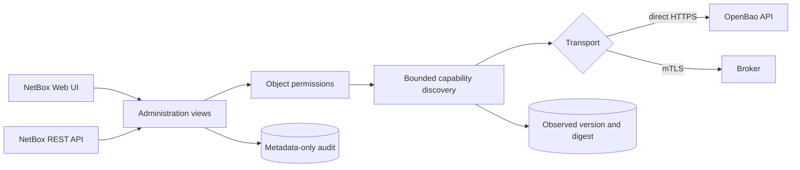
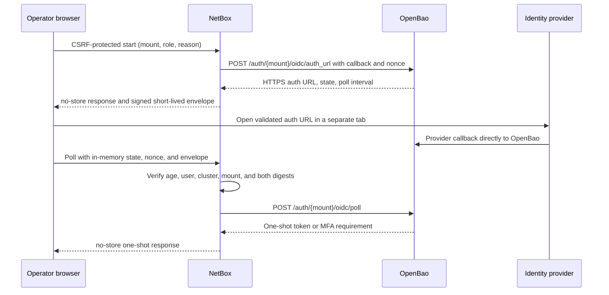
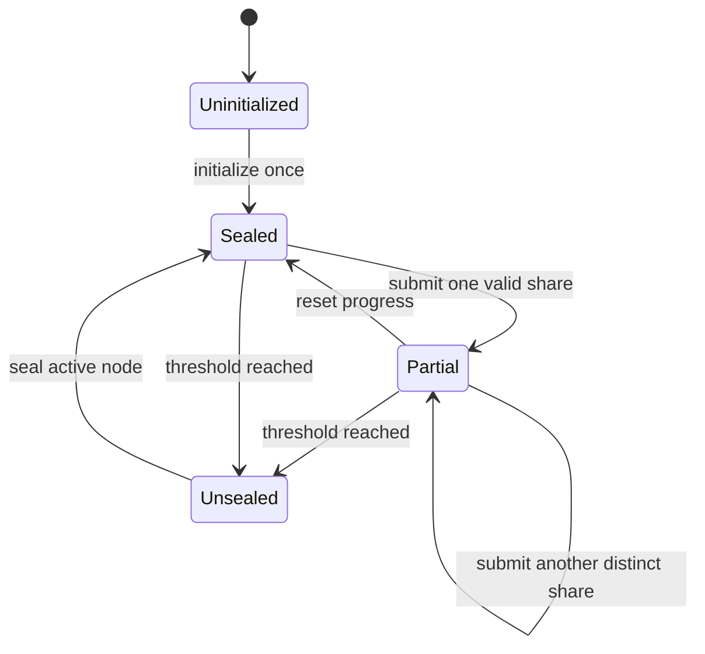

# OpenBao administration plane

OpenBao 2.6 includes its own Web UI on the API listener. When `ui = true`, the
server exposes it at `/ui/`; that interface remains useful for break-glass and
direct-vault administration. netbox-openbao is building a separate,
NetBox-native administration plane so operators can manage OpenBao through the
same inventory, object permissions, audit correlation, and API conventions as
the rest of their infrastructure.

This page describes the security and compatibility foundation plus the
implemented authentication, MFA, initialization, unseal, seal, and
Raft-storage journeys. The
cluster-bootstrap parity family remains `foundation` because guarded Raft join
is assigned to issue #70. This page does **not** claim that every OpenBao
operation is executable yet. Runtime discovery remains display-only unless a
concrete view constrains an operation's inputs and outputs, assigns a dedicated
permission, and supplies tests for its risk class.

## Boundary



`OpenBaoCluster` owns the API endpoint, namespace, authentication method, TLS
policy, and optional host-device binding. A cluster is independent of a mounted
secrets engine. `SecretEngine` remains the credential-storage mount and points
to a cluster through a nullable compatibility relation.

Migration `0011_openbao_administration_foundation` creates one cluster for every
existing engine and assigns the relation. It deliberately retains the engine's
connection fields during the compatibility period; credential traffic continues
to use those fields until the later engine-lifecycle work migrates all callers.
Rolling the migration back first clears the compatibility relation, then drops
the new cluster and administration-log tables. It does not delete an engine.

Authentication material is absent from both models. The cluster slug derives
the same environment contract as an engine: `prod-core` becomes
`NETBOX_BAO_PROD_CORE`. Role IDs, secret IDs, tokens, JWTs, and private keys
remain in environment variables or referenced files.

## Runtime capability discovery

Direct mode requests only:

```text
GET /v1/sys/internal/specs/openapi?generic_mount_paths=true
```

The request uses the cluster's authenticated service identity, namespace, TLS
verification, a 30-second timeout, streaming response limits, and disabled
redirects. The response is rejected unless all of these checks pass:

- at most 2,000,000 encoded bytes;
- an OpenAPI 3.x object with a `paths` mapping;
- at most 2,000 paths and 5,000 operations;
- at most 30 levels of nesting;
- bounded strings, tags, operation IDs, and collection sizes;
- safe absolute path templates with no traversal, backslashes, queries, or
  duplicate separators;
- constrained operation IDs and reviewed HTTP methods. OpenBao may reuse an
  operation ID across methods, so the normalized unique key is `METHOD /path`.

The normalized representation stores or returns only the OpenAPI version,
OpenBao version, SHA-256 digest, operation identifier, method, path template,
short summary, tags, family, response class, risk level, permission name, and
bounded query and top-level JSON request-field names and primitive types.
Examples, defaults,
submitted request bodies, response schemas and bodies, and upstream diagnostic
text are excluded.

Every discovered operation has `executable = false`, including classified
operations. Classification describes where review belongs; it does not grant
execution. Unknown routes remain `unclassified`, carry no permission, and fail
closed.

Broker health uses the existing broker transport. Capability discovery through
the broker fails closed until the broker advertises an equivalent bounded
administration contract. The plugin never silently bypasses broker isolation by
calling OpenBao directly.

## Authentication administration boundary

Authentication administration has two independent authorization layers. The
NetBox user must hold the dedicated, object-constrained action permission for
the requested cluster. The cluster's OpenBao service identity must separately
hold the exact upstream capability. Neither identity is substituted for the
other: NetBox permissions do not mint OpenBao credentials, and the cluster
service token is never placed in the user's browser.

The executable registry is fixed to the reviewed OpenBao 2.6.2 contract. It
contains auth mount lifecycle, method configuration, typed token, userpass,
AppRole, Kubernetes, JWT/OIDC, LDAP, and certificate resources, AppRole RoleID
and SecretID operations, request-scoped login, direct OIDC, token self/accessor
operations, and TOTP/Duo/Okta/PingID methods and login enforcements. Runtime
OpenAPI discovery proves that the named reviewed operation exists and supplies
the capability digest for audit correlation. It never supplies an executable
path, input field, output field, permission, risk class, or renderer. Unknown
fields and response shapes fail closed.

Direct transport constructs every upstream URL from a static template plus a
validated mount or resource segment. Redirects are disabled. Submitted
self-service tokens are placed in the header of one request and do not mutate
the pooled session or the cluster service client's cached token. Broker mode
inherits unsupported methods from the administration contract and therefore
fails closed until the broker explicitly implements the same fixed surface.

## Token and authentication material custody

Passwords, JWTs, tokens, RoleIDs, SecretIDs, MFA request IDs and passcodes,
provider secrets, PingID settings, OIDC state and nonces, and TOTP provisioning
material have no persistence path. Request serializers declare material fields
write-only where the shape is explicit; advanced method payloads pass through a
static field registry whose material markers drive response redaction. Backend
objects use redacted representations. Responses containing material use only
the JSON renderer plus `no-store`, and audit records contain fixed summaries
rather than request or response values.

NetBox does not establish an OpenBao browser session. A successful login or
renewal returns a token once, but later NetBox requests do not inherit it.
Closing the page clears browser memory but does not revoke an OpenBao token;
revocation is a separate, confirmed upstream operation. This distinction keeps
token lifetime under OpenBao policy and makes logout semantics explicit rather
than implying that a NetBox session controls an OpenBao lease.

## Direct OIDC flow



The callback is the exact OpenBao API URL
`/v1/auth/{mount}/oidc/callback` for the root namespace or
`/v1/{namespace}/auth/{mount}/oidc/callback` for a safely encoded nested
namespace; provider authorization codes never reach a NetBox route. The
namespace must be carried in the URL because the identity provider cannot add
`X-Vault-Namespace`. Authorization URLs must be HTTPS, except for explicit
loopback development addresses, must contain no user information or fragment,
and must carry exactly the state OpenBao returned. The signed envelope expires
after five minutes and binds digests rather than retaining raw state or nonce
on the server. JavaScript keeps the values in a closure only, never in
`localStorage`, `sessionStorage`, a cookie, or a URL. The local controller also
expires after five minutes and clears on successful polling, an invalid or
expired envelope response, or `pagehide`; ordinary visibility changes preserve
it during provider handoff. OpenBao consumes state after a successful poll,
providing the final replay boundary. Client callback and device modes are not
executable through this contract. NetBox also rejects roles that disable
direct-mode confirmation or enable verbose OIDC token and claim logging.

## MFA control plane

MFA methods and login enforcements use static OpenBao 2.6.2 per-provider
schemas. TOTP setup returns its URI and a validated PNG barcode once.
Administrator setup is explicitly
entity-scoped and uses the cluster service identity; self-setup uses an
explicitly submitted OpenBao token only for one
`/identity/mfa/method/totp/generate` request. Self-reset looks up that submitted
token's entity and then uses the service identity's fixed administrator-destroy
path; no caller-supplied entity can cross that boundary. Provider API tokens, shared keys,
and settings files are accepted only as bounded write-only fields. Login
responses normalize either a token or a bounded MFA requirement; MFA validation
accepts only a bounded map of method IDs to values and returns the completed
token once.

Deleting a method, enforcement, or entity TOTP setup requires a dedicated
permission, reason, and cluster-specific confirmation. Operators must preserve
an alternate login path while changing enforcement because neither NetBox nor
OpenBao can atomically prove that a future external identity-provider login
will succeed.

## Cluster lifecycle state machine



Initialization first reads both seal and initialization status. It is refused
if either says the cluster is already initialized. A successful response is
returned once with the JSON renderer and `no-store`; the keys and initial root
token never enter a model, session, cache, message, task, exception, screenshot,
or audit record. The preflight authorization audit must commit before the
write. If the post-success audit insert fails, the response is still returned
with `X-OpenBao-Audit-Status: preflight-only`, because withholding newly issued
custody material would make recovery impossible.

Unseal accepts one share per request. The serializer and view discard the share
after the backend call and return only normalized progress. Reset is a separate
confirmed request. Seal re-reads status immediately before the mutation. The
implemented lifecycle contract is pinned to reviewed OpenBao releases from
2.6.2 through the 2.6.x line; an older, malformed, missing, or 2.7.0-or-later
version fails closed.

## HA, standby, and Raft safety

Leader and HA responses are bounded and normalized before rendering. A
destructive action requires the configured endpoint to report that it is the
active node. Arbitrary HTTP redirects remain disabled, so an upstream response
cannot turn the service identity into a server-side request to an attacker.
Normal OpenBao internal standby forwarding may still occur inside the cluster.
If the contacted HTTP endpoint reports itself as a standby, the plugin returns
a conflict and the operator must select the reviewed active endpoint; it does
not follow the reported leader URL.

Peer removal includes the exact server ID and the observed configuration index
in its confirmation contract. The view re-reads the configuration, refuses a
stale index, refuses leader removal, and refuses removal of a voter when only
three voters remain. It then audits authorization before sending the fixed
`/sys/storage/raft/remove-peer` request.

The configuration index and cluster ID are stale-UI detectors rather than an
atomic Raft compare-and-swap. OpenBao does not accept them as server-enforced
preconditions on peer removal or snapshot restore. Operators must freeze direct
membership changes during the ceremony and verify state afterward because an
external change can still race after the final preflight read.

## Snapshot streaming design

Downloads use an authenticated fixed-path upstream request. The response is
streamed in 64 KiB chunks, bounded to 512 MiB both by a declared length and by
bytes observed, and closed when completed or cancelled. The downstream response
uses `application/octet-stream`, an attachment filename generated from the
cluster slug, `X-Content-Type-Options: nosniff`, and `Cache-Control: no-store`.
Audit records distinguish authorization, completion, and incomplete transfer
without containing bytes or a content-derived value. The upstream request forces
identity encoding and rejects any encoded response. A session-authenticated
browser download is a confirmed CSRF-protected POST; authenticated API tokens
retain GET access.

Restores accept only a raw `application/octet-stream` body with a declared size
from 1 through 512 MiB. Multipart and encoded bodies are rejected before
backend access. The browser sends the selected `File` directly; Django never
invokes multipart upload handlers, and the plugin does not create a temporary
file or an in-memory copy. The stream wrapper bounds every read. A fresh cluster
ID, Raft index, active-node check, storage check, reason, and exact confirmation
must pass before the body is read. Normal restore and seal-consistency-bypassing
force restore have separate routes and permissions. Neither request is retried
after a transport failure because its outcome may be unknown.

## Secrets-engine lifecycle and classified explorer

Secrets-engine lifecycle uses fixed `/sys/mounts` and `/sys/remount` contracts
for listing, configuration reads, tuning reads and writes, enable, asynchronous
remount status, and guarded disable. The view reloads live mount state before a
mutation so a stale browser cannot enable an existing mount, tune or disable a
missing mount, or remount from or onto changed state. Disabling also refuses a
mount that still backs NetBox credential inventory.

The mounted-operation explorer is an intersection, not an arbitrary OpenAPI
proxy. Runtime discovery proves the current operation and supplies bounded path,
query, and top-level request-body field names and primitive types. The reviewed
registry admits only GET, LIST, POST, PUT, PATCH, and DELETE templates in the
mounted-secrets family whose paths are rooted at `/{secret_mount_path}`, contain
only safe literal or bounded parameter segments, and declare every placeholder
as required and typed. The server chooses the origin, `/v1` prefix,
method, service identity, namespace header, TLS policy, timeout, response size,
redirect policy, permission, risk, and material response class. A caller sends
an operation key, current capability digest, live mount, bounded parameter
values, declared query and body fields with matching JSON types, and an audit
reason. Runtime advertisement alone cannot bypass the mounted grammar or any
authorization, stale-state, material, audit, or transport boundary.

All explorer responses are conservatively classified as secret material.
Reads, non-destructive writes, mounted-resource deletion or destruction, and
whole-engine disable use separate object permissions. A destructive execution
also requires an exact confirmation over its advertised HTTP method, compiled
mount path, and cluster slug. The result has no persistence route and uses the
JSON renderer with `no-store`; browser memory clears on demand, after five
minutes, and on `pagehide`. A transport or response-parsing failure after a
mutation is an unknown outcome and is never retried automatically.

Broker mode inherits unsupported lifecycle and explorer methods and therefore
fails closed. It must implement and advertise the equivalent reviewed contract
before these actions become available through the broker.

## Permissions

The cluster model supplies these custom actions in addition to NetBox's normal
view/add/change/delete permissions:

| Permission | Purpose |
|---|---|
| `discover_openbaocluster` | Read and normalize advertised capability metadata |
| `operate_openbaocluster` | Reserved risk-class permission for reviewed non-sensitive writes |
| `operate_sensitive_openbaocluster` | Reserved risk-class permission for material-bearing operations |
| `operate_destructive_openbaocluster` | Reserved risk-class permission for destructive operations |
| `initialize_openbaocluster` | Initialize a cluster once |
| `unseal_openbaocluster` | Submit one share or reset unseal progress |
| `seal_openbaocluster` | Seal an active cluster |
| `manage_raft_openbaocluster` | Reserved Raft administration permission |
| `remove_raft_peer_openbaocluster` | Remove a guarded Raft peer |
| `download_raft_snapshot_openbaocluster` | Stream a Raft snapshot to the operator |
| `restore_raft_snapshot_openbaocluster` | Perform a normal snapshot restore |
| `force_restore_raft_snapshot_openbaocluster` | Bypass the normal seal-consistency check during restore |
| `view_authentication_openbaocluster` | View authentication and MFA metadata and the workspace |
| `manage_auth_methods_openbaocluster` | Enable, configure, tune, and remount auth methods |
| `disable_auth_methods_openbaocluster` | Disable an auth method after confirmation |
| `manage_auth_resources_openbaocluster` | Manage reviewed method-specific resources |
| `delete_auth_resources_openbaocluster` | Delete typed resources and destroy SecretIDs |
| `issue_auth_material_openbaocluster` | Issue one-shot AppRole SecretIDs |
| `authenticate_openbaocluster` | Run request-scoped login, OIDC polling, and MFA validation |
| `manage_tokens_openbaocluster` | Look up and renew submitted tokens or accessors |
| `revoke_tokens_openbaocluster` | Revoke submitted tokens or accessors after confirmation |
| `manage_mfa_openbaocluster` | Manage MFA methods, TOTP setup, and enforcements |
| `delete_mfa_openbaocluster` | Delete MFA state after confirmation |
| `view_secret_engines_openbaocluster` | List mounts and read configuration and tuning metadata |
| `manage_secret_engines_openbaocluster` | Enable, tune, and remount secret engines |
| `disable_secret_engines_openbaocluster` | Disable an entire secret engine after confirmation |
| `explore_secret_operations_openbaocluster` | Load classified mounted-operation metadata |
| `execute_secret_operations_openbaocluster` | Execute reviewed non-destructive mounted writes |
| `delete_secret_operations_openbaocluster` | Delete or destroy mounted resources after confirmation |
| `reveal_secret_operations_openbaocluster` | Execute reads whose response may contain material |
| `reveal_kv_secrets_openbaocluster` / `manage_kv_secrets_openbaocluster` / `destroy_kv_versions_openbaocluster` | Separate KV reads, ordinary mutations, and destructive version lifecycle |
| `use_transit_openbaocluster` / `manage_transit_keys_openbaocluster` / `delete_transit_keys_openbaocluster` | Transit cryptographic use, key management, and key deletion |
| `generate_database_credentials_openbaocluster` / `manage_database_roles_openbaocluster` / `delete_database_resources_openbaocluster` / `rotate_database_credentials_openbaocluster` | Database credential generation, configuration, deletion, and guarded rotation/reset |
| `issue_ssh_credentials_openbaocluster` / `manage_ssh_roles_openbaocluster` / `delete_ssh_roles_openbaocluster` | SSH credential/signing operations, role management, and role deletion |
| `generate_totp_codes_openbaocluster` / `manage_totp_keys_openbaocluster` / `delete_totp_keys_openbaocluster` | TOTP code use, key management, and key deletion |
| `view_pki_openbaocluster` / `manage_pki_configuration_openbaocluster` | PKI reads and configuration management |
| `manage_pki_issuers_openbaocluster` / `delete_pki_issuers_openbaocluster` | PKI issuer lifecycle with separate deletion authority |
| `manage_pki_keys_openbaocluster` / `generate_pki_keys_openbaocluster` / `delete_pki_keys_openbaocluster` | PKI key import/metadata, generation, and deletion as separate authorities |
| `manage_pki_roles_openbaocluster` / `delete_pki_roles_openbaocluster` | PKI issuance-role lifecycle with separate deletion authority |
| `issue_pki_certificates_openbaocluster` / `revoke_pki_certificates_openbaocluster` | Certificate issuance/signing and separately confirmed revocation |
| `rotate_pki_roots_openbaocluster` / `delete_pki_roots_openbaocluster` / `tidy_pki_openbaocluster` | Confirmed root generation/rotation, delete-all-root state, and tidy operations |
| `view_kubernetes_engine_openbaocluster` / `manage_k8s_configuration_openbaocluster` / `delete_k8s_configuration_openbaocluster` | Kubernetes engine reads, connection configuration, and configuration deletion |
| `manage_kubernetes_roles_openbaocluster` / `delete_kubernetes_roles_openbaocluster` | Kubernetes role lifecycle with separate deletion authority |
| `generate_k8s_credentials_openbaocluster` | Request-scoped Kubernetes credential generation |

`view_openbaocluster` alone does not grant discovery. Both UI and API queries
use `RestrictedQuerySet.restrict()`, so NetBox object-permission constraints
apply and an out-of-scope cluster is hidden with `404`.

## Audit and cache policy

Every health probe and capability discovery writes an
`OpenBaoAdministrationLog` record synchronously. Audit failure blocks a
successful response. The record contains the NetBox actor, cluster snapshots,
source IP, request ID, action, reviewed path template, risk, status, capability
digest, and a fixed safe message. It has no field for authentication material,
request bodies, response bodies, or backend diagnostics.

Mutation preflight records use a durable outermost database transaction and
carry the explicit `authorized` outcome. An
ambient `ATOMIC_REQUESTS` or application transaction therefore fails closed
before OpenBao is contacted. If OpenBao accepts a mutation but the completion
record fails, the response remains successful and explicitly reports
`accepted-audit-incomplete`; clients must verify state and must not retry.
Transport loss after dispatch and accepted responses that fail bounded parsing
return `outcome: unknown` with `audit_status: preflight-only`; the follow-up
metadata audit also records `unknown`. Clients must reconcile state and must not
retry. Browser-side loss before a response can be validated uses
`audit_status: unconfirmed`, because the client cannot prove a preflight record
exists, and preserves that warning even if a reconciliation refresh fails.

The Web UI and API administration responses send `Cache-Control: no-store` and
the corresponding legacy cache headers. Backend failures become the fixed
message `OpenBao administration is unavailable.` and never include server text.
The audit API and UI are read-only. Authentication material shown in the Web UI
is inserted with `textContent`; validated TOTP PNG bytes use a fixed
`data:image/png;base64,` image source. Material is automatically cleared after
five minutes or on `pagehide`, while an ordinary visibility change preserves
it for authenticator handoff. The bounded direct
OIDC state remains in the current tab's JavaScript closure while the operator
uses the provider tab; both the local controller and the signed server envelope
expire after five minutes. Successful polling, an invalid or expired envelope,
and `pagehide` also clear the controller. The browser code contains no generic
HTML insertion, browser storage, automatic polling, or mutation retry path.

## Parity baseline

`netbox_openbao/administration/openbao-ui-v2.6.2.json` is the checked-in parity
manifest for stable OpenBao 2.6.2. It records the upstream UI route families,
the intended capability, implementation status, and owning work item. Every
complete family requires an equivalence statement and existing implementation,
UI, and test evidence for every upstream route key. The equivalence and
evidence key sets must exactly match `upstream_routes`, so adding or removing a
route cannot leave a complete family green without route-specific proof. The
strict checker rejects drift in the baseline, shape, status vocabulary, route
ownership, evidence, or duplicate family identifiers:

```bash
python scripts/check_openbao_ui_parity.py
```

The baseline includes cluster session and bootstrap, Raft storage, API
exploration, auth methods, MFA, engine lifecycle, generic mounted engines, KV,
transit/database/SSH/TOTP, PKI, Kubernetes, policies, identity, OIDC,
namespaces, leases, tools, and UI configuration. A family marked `planned` is
not implemented. The `cluster-session`, `auth-methods`, `mfa`, `kv`,
`common-engines`, `pki`, and `kubernetes` families are complete through
request-scoped typed workspaces. Completion
requires a Web UI, REST API, authorization, auditing, direct/broker behavior,
hostile-input tests, and live OpenBao/browser evidence.

## Network placement

The administration plane does not make a public OpenBao listener safe. Keep
both the built-in OpenBao UI and the NetBox administrative routes behind the
management network or VPN, use TLS certificates valid for the names operators
use, and grant the NetBox service identity only the capabilities implemented in
the reviewed registry. Applications should continue to use OpenBao's API, CLI,
or native authentication integrations; they must never automate either Web UI.

## References

- [OpenBao UI configuration](https://openbao.org/docs/configuration/ui/)
- [OpenBao HTTP API](https://openbao.org/api-docs/)
- [OpenBao 2.6.2 release](https://github.com/openbao/openbao/releases/tag/v2.6.2)
- [Authentication and MFA runbook](../how-to/administer-openbao-authentication.md)
