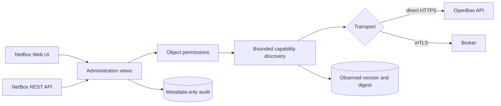
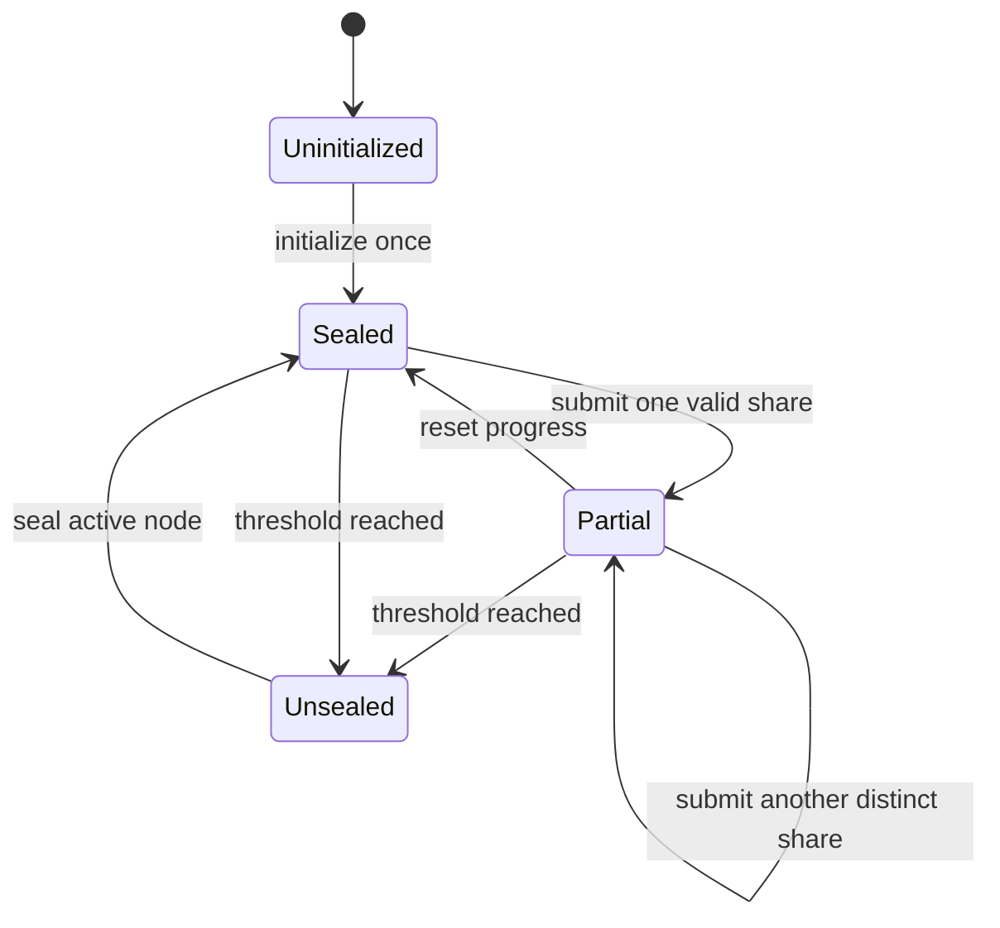

# OpenBao administration plane

OpenBao 2.6 includes its own Web UI on the API listener. When `ui = true`, the
server exposes it at `/ui/`; that interface remains useful for break-glass and
direct-vault administration. netbox-openbao is building a separate,
NetBox-native administration plane so operators can manage OpenBao through the
same inventory, object permissions, audit correlation, and API conventions as
the rest of their infrastructure.

This page describes the security and compatibility foundation plus the
implemented initialization, unseal, seal, and Raft-storage journeys. The
cluster-bootstrap parity family remains `foundation` because guarded Raft join
is assigned to issue #70. This page does **not** claim that every OpenBao
operation is executable yet. Runtime discovery remains display-only unless a
concrete view constrains an operation's inputs and outputs, assigns a dedicated
permission, and supplies tests for its risk class.

## Boundary



`OpenBaoCluster` owns the API endpoint, namespace, authentication method, TLS
policy, and optional host-device binding. A cluster is independent of a mounted
secrets engine. `SecretEngine` remains the credential-storage mount and points
to a cluster through a nullable compatibility relation.

Migration `0011_openbao_administration_foundation` creates one cluster for every
existing engine and assigns the relation. It deliberately retains the engine's
connection fields during the compatibility period; credential traffic continues
to use those fields until the later engine-lifecycle work migrates all callers.
Rolling the migration back first clears the compatibility relation, then drops
the new cluster and administration-log tables. It does not delete an engine.

Authentication material is absent from both models. The cluster slug derives
the same environment contract as an engine: `prod-core` becomes
`NETBOX_BAO_PROD_CORE`. Role IDs, secret IDs, tokens, JWTs, and private keys
remain in environment variables or referenced files.

## Runtime capability discovery

Direct mode requests only:

```text
GET /v1/sys/internal/specs/openapi?generic_mount_paths=true
```

The request uses the cluster's authenticated service identity, namespace, TLS
verification, a 30-second timeout, streaming response limits, and disabled
redirects. The response is rejected unless all of these checks pass:

- at most 2,000,000 encoded bytes;
- an OpenAPI 3.x object with a `paths` mapping;
- at most 2,000 paths and 5,000 operations;
- at most 30 levels of nesting;
- bounded strings, tags, operation IDs, and collection sizes;
- safe absolute path templates with no traversal, backslashes, queries, or
  duplicate separators;
- constrained operation IDs and reviewed HTTP methods. OpenBao may reuse an
  operation ID across methods, so the normalized unique key is `METHOD /path`.

The normalized representation stores or returns only the OpenAPI version,
OpenBao version, SHA-256 digest, operation identifier, method, path template,
short summary, tags, family, response class, risk level, and permission name.
Request schemas, examples, defaults, request bodies, response bodies, and
upstream diagnostic text are excluded.

Every discovered operation has `executable = false`, including classified
operations. Classification describes where review belongs; it does not grant
execution. Unknown routes remain `unclassified`, carry no permission, and fail
closed.

Broker health uses the existing broker transport. Capability discovery through
the broker fails closed until the broker advertises an equivalent bounded
administration contract. The plugin never silently bypasses broker isolation by
calling OpenBao directly.

## Cluster lifecycle state machine



Initialization first reads both seal and initialization status. It is refused
if either says the cluster is already initialized. A successful response is
returned once with the JSON renderer and `no-store`; the keys and initial root
token never enter a model, session, cache, message, task, exception, screenshot,
or audit record. The preflight authorization audit must commit before the
write. If the post-success audit insert fails, the response is still returned
with `X-OpenBao-Audit-Status: preflight-only`, because withholding newly issued
custody material would make recovery impossible.

Unseal accepts one share per request. The serializer and view discard the share
after the backend call and return only normalized progress. Reset is a separate
confirmed request. Seal re-reads status immediately before the mutation. The
implemented lifecycle contract is pinned to reviewed OpenBao releases from
2.6.2 through the 2.6.x line; an older, malformed, missing, or 2.7.0-or-later
version fails closed.

## HA, standby, and Raft safety

Leader and HA responses are bounded and normalized before rendering. A
destructive action requires the configured endpoint to report that it is the
active node. Arbitrary HTTP redirects remain disabled, so an upstream response
cannot turn the service identity into a server-side request to an attacker.
Normal OpenBao internal standby forwarding may still occur inside the cluster.
If the contacted HTTP endpoint reports itself as a standby, the plugin returns
a conflict and the operator must select the reviewed active endpoint; it does
not follow the reported leader URL.

Peer removal includes the exact server ID and the observed configuration index
in its confirmation contract. The view re-reads the configuration, refuses a
stale index, refuses leader removal, and refuses removal of a voter when only
three voters remain. It then audits authorization before sending the fixed
`/sys/storage/raft/remove-peer` request.

The configuration index and cluster ID are stale-UI detectors rather than an
atomic Raft compare-and-swap. OpenBao does not accept them as server-enforced
preconditions on peer removal or snapshot restore. Operators must freeze direct
membership changes during the ceremony and verify state afterward because an
external change can still race after the final preflight read.

## Snapshot streaming design

Downloads use an authenticated fixed-path upstream request. The response is
streamed in 64 KiB chunks, bounded to 512 MiB both by a declared length and by
bytes observed, and closed when completed or cancelled. The downstream response
uses `application/octet-stream`, an attachment filename generated from the
cluster slug, `X-Content-Type-Options: nosniff`, and `Cache-Control: no-store`.
Audit records distinguish authorization, completion, and incomplete transfer
without containing bytes or a content-derived value. The upstream request forces
identity encoding and rejects any encoded response. A session-authenticated
browser download is a confirmed CSRF-protected POST; authenticated API tokens
retain GET access.

Restores accept only a raw `application/octet-stream` body with a declared size
from 1 through 512 MiB. Multipart and encoded bodies are rejected before
backend access. The browser sends the selected `File` directly; Django never
invokes multipart upload handlers, and the plugin does not create a temporary
file or an in-memory copy. The stream wrapper bounds every read. A fresh cluster
ID, Raft index, active-node check, storage check, reason, and exact confirmation
must pass before the body is read. Normal restore and seal-consistency-bypassing
force restore have separate routes and permissions. Neither request is retried
after a transport failure because its outcome may be unknown.

## Permissions

The cluster model supplies these custom actions in addition to NetBox's normal
view/add/change/delete permissions:

| Permission | Purpose |
|---|---|
| `discover_openbaocluster` | Read and normalize advertised capability metadata |
| `operate_openbaocluster` | Reserved risk-class permission for reviewed non-sensitive writes |
| `operate_sensitive_openbaocluster` | Reserved risk-class permission for material-bearing operations |
| `operate_destructive_openbaocluster` | Reserved risk-class permission for destructive operations |
| `initialize_openbaocluster` | Initialize a cluster once |
| `unseal_openbaocluster` | Submit one share or reset unseal progress |
| `seal_openbaocluster` | Seal an active cluster |
| `manage_raft_openbaocluster` | Reserved Raft administration permission |
| `remove_raft_peer_openbaocluster` | Remove a guarded Raft peer |
| `download_raft_snapshot_openbaocluster` | Stream a Raft snapshot to the operator |
| `restore_raft_snapshot_openbaocluster` | Perform a normal snapshot restore |
| `force_restore_raft_snapshot_openbaocluster` | Bypass the normal seal-consistency check during restore |

`view_openbaocluster` alone does not grant discovery. Both UI and API queries
use `RestrictedQuerySet.restrict()`, so NetBox object-permission constraints
apply and an out-of-scope cluster is hidden with `404`.

## Audit and cache policy

Every health probe and capability discovery writes an
`OpenBaoAdministrationLog` record synchronously. Audit failure blocks a
successful response. The record contains the NetBox actor, cluster snapshots,
source IP, request ID, action, reviewed path template, risk, status, capability
digest, and a fixed safe message. It has no field for authentication material,
request bodies, response bodies, or backend diagnostics.

Mutation preflight records use a durable outermost database transaction. An
ambient `ATOMIC_REQUESTS` or application transaction therefore fails closed
before OpenBao is contacted. If OpenBao accepts a mutation but the completion
record fails, the response remains successful and explicitly reports
`accepted-audit-incomplete`; clients must verify state and must not retry.

The Web UI and API administration responses send `Cache-Control: no-store` and
the corresponding legacy cache headers. Backend failures become the fixed
message `OpenBao administration is unavailable.` and never include server text.
The audit API and UI are read-only.

## Parity baseline

`netbox_openbao/administration/openbao-ui-v2.6.2.json` is the checked-in parity
manifest for stable OpenBao 2.6.2. It records the upstream UI route families,
the intended capability, implementation status, and owning work item. The
strict checker rejects drift in the baseline, shape, status vocabulary, route
ownership, or duplicate family identifiers:

```bash
python scripts/check_openbao_ui_parity.py
```

The baseline includes cluster session and bootstrap, Raft storage, API
exploration, auth methods, MFA, engine lifecycle, generic mounted engines, KV,
transit/database/SSH/TOTP, PKI, Kubernetes, policies, identity, OIDC,
namespaces, leases, tools, and UI configuration. A family marked `planned` is
not implemented. Completion requires its Web UI, REST API, authorization,
auditing, direct/broker behavior, hostile-input tests, and live OpenBao/browser
evidence.

## Network placement

The administration plane does not make a public OpenBao listener safe. Keep
both the built-in OpenBao UI and the NetBox administrative routes behind the
management network or VPN, use TLS certificates valid for the names operators
use, and grant the NetBox service identity only the capabilities implemented in
the reviewed registry. Applications should continue to use OpenBao's API, CLI,
or native authentication integrations; they must never automate either Web UI.

## References

- [OpenBao UI configuration](https://openbao.org/docs/configuration/ui/)
- [OpenBao HTTP API](https://openbao.org/api-docs/)
- [OpenBao 2.6.2 release](https://github.com/openbao/openbao/releases/tag/v2.6.2)
