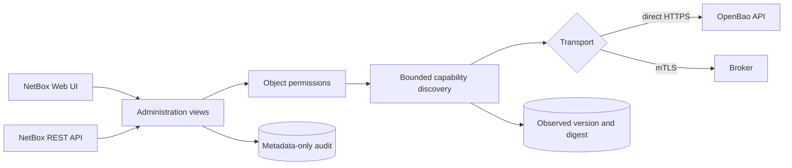

# OpenBao administration plane

OpenBao 2.6 includes its own Web UI on the API listener. When `ui = true`, the
server exposes it at `/ui/`; that interface remains useful for break-glass and
direct-vault administration. netbox-openbao is building a separate,
NetBox-native administration plane so operators can manage OpenBao through the
same inventory, object permissions, audit correlation, and API conventions as
the rest of their infrastructure.

This page describes the security and compatibility foundation. It does **not**
claim that every OpenBao operation is executable yet. Runtime discovery is
display-only until a later implementation classifies an operation, constrains
its inputs and outputs, assigns a dedicated permission, and supplies tests for
its risk class.

## Boundary



`OpenBaoCluster` owns the API endpoint, namespace, authentication method, TLS
policy, and optional host-device binding. A cluster is independent of a mounted
secrets engine. `SecretEngine` remains the credential-storage mount and points
to a cluster through a nullable compatibility relation.

Migration `0011_openbao_administration_foundation` creates one cluster for every
existing engine and assigns the relation. It deliberately retains the engine's
connection fields during the compatibility period; credential traffic continues
to use those fields until the later engine-lifecycle work migrates all callers.
Rolling the migration back first clears the compatibility relation, then drops
the new cluster and administration-log tables. It does not delete an engine.

Authentication material is absent from both models. The cluster slug derives
the same environment contract as an engine: `prod-core` becomes
`NETBOX_BAO_PROD_CORE`. Role IDs, secret IDs, tokens, JWTs, and private keys
remain in environment variables or referenced files.

## Runtime capability discovery

Direct mode requests only:

```text
GET /v1/sys/internal/specs/openapi?generic_mount_paths=true
```

The request uses the cluster's authenticated service identity, namespace, TLS
verification, a 30-second timeout, streaming response limits, and disabled
redirects. The response is rejected unless all of these checks pass:

- at most 2,000,000 encoded bytes;
- an OpenAPI 3.x object with a `paths` mapping;
- at most 2,000 paths and 5,000 operations;
- at most 30 levels of nesting;
- bounded strings, tags, operation IDs, and collection sizes;
- safe absolute path templates with no traversal, backslashes, queries, or
  duplicate separators;
- constrained operation IDs and reviewed HTTP methods. OpenBao may reuse an
  operation ID across methods, so the normalized unique key is `METHOD /path`.

The normalized representation stores or returns only the OpenAPI version,
OpenBao version, SHA-256 digest, operation identifier, method, path template,
short summary, tags, family, response class, risk level, and permission name.
Request schemas, examples, defaults, request bodies, response bodies, and
upstream diagnostic text are excluded.

Every discovered operation has `executable = false`, including classified
operations. Classification describes where review belongs; it does not grant
execution. Unknown routes remain `unclassified`, carry no permission, and fail
closed.

Broker health uses the existing broker transport. Capability discovery through
the broker fails closed until the broker advertises an equivalent bounded
administration contract. The plugin never silently bypasses broker isolation by
calling OpenBao directly.

## Permissions

The cluster model supplies four custom actions in addition to NetBox's normal
view/add/change/delete permissions:

| Permission | Purpose |
|---|---|
| `discover_openbaocluster` | Read and normalize advertised capability metadata |
| `operate_openbaocluster` | Execute reviewed non-sensitive writes in later work |
| `operate_sensitive_openbaocluster` | Execute reviewed material-bearing operations in later work |
| `operate_destructive_openbaocluster` | Execute destructive operations in later work |

`view_openbaocluster` alone does not grant discovery. Both UI and API queries
use `RestrictedQuerySet.restrict()`, so NetBox object-permission constraints
apply and an out-of-scope cluster is hidden with `404`.

## Audit and cache policy

Every health probe and capability discovery writes an
`OpenBaoAdministrationLog` record synchronously. Audit failure blocks a
successful response. The record contains the NetBox actor, cluster snapshots,
source IP, request ID, action, reviewed path template, risk, status, capability
digest, and a fixed safe message. It has no field for authentication material,
request bodies, response bodies, or backend diagnostics.

The Web UI and API administration responses send `Cache-Control: no-store` and
the corresponding legacy cache headers. Backend failures become the fixed
message `OpenBao administration is unavailable.` and never include server text.
The audit API and UI are read-only.

## Parity baseline

`netbox_openbao/administration/openbao-ui-v2.6.2.json` is the checked-in parity
manifest for stable OpenBao 2.6.2. It records the upstream UI route families,
the intended capability, implementation status, and owning work item. The
strict checker rejects drift in the baseline, shape, status vocabulary, route
ownership, or duplicate family identifiers:

```bash
python scripts/check_openbao_ui_parity.py
```

The baseline includes cluster session and bootstrap, Raft storage, API
exploration, auth methods, MFA, engine lifecycle, generic mounted engines, KV,
transit/database/SSH/TOTP, PKI, Kubernetes, policies, identity, OIDC,
namespaces, leases, tools, and UI configuration. A family marked `planned` is
not implemented. Completion requires its Web UI, REST API, authorization,
auditing, direct/broker behavior, hostile-input tests, and live OpenBao/browser
evidence.

## Network placement

The administration plane does not make a public OpenBao listener safe. Keep
both the built-in OpenBao UI and the NetBox administrative routes behind the
management network or VPN, use TLS certificates valid for the names operators
use, and grant the NetBox service identity only the capabilities implemented in
the reviewed registry. Applications should continue to use OpenBao's API, CLI,
or native authentication integrations; they must never automate either Web UI.

## References

- [OpenBao UI configuration](https://openbao.org/docs/configuration/ui/)
- [OpenBao HTTP API](https://openbao.org/api-docs/)
- [OpenBao 2.6.2 release](https://github.com/openbao/openbao/releases/tag/v2.6.2)
