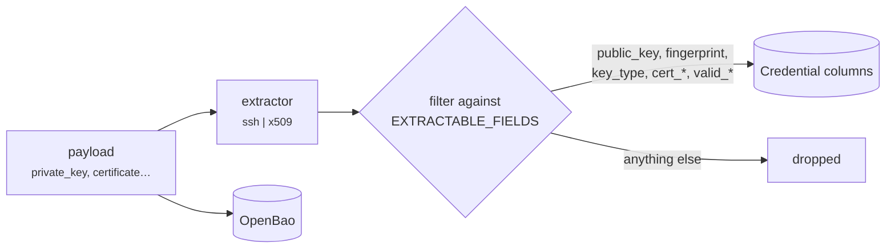

# Credential types

A credential type answers two questions: **which payload fields does OpenBao
accept**, and **which non-secret attributes are extracted into NetBox**.

There are two kinds. Built-in types are Python. Operator-defined types are rows.

## Built-in types

Declared in `choices.CredentialTypeChoices` and described in
`secrets.registry.CREDENTIAL_SCHEMAS`:

| Type | Required | Optional | Extractor |
|---|---|---|---|
| `password` | `password` | | — |
| `ssh-password` | `password` | | — |
| `api-token` | `token` | | — |
| `ssh-keypair` | `private_key` | `passphrase`, `public_key` | `ssh` |
| `x509-keypair` | `private_key`, `certificate` | `chain` | `x509` |
| `x509-ca` | `certificate` | `private_key` | `x509` |
| `snmp-v3` | `auth_password` | `priv_password`, `auth_protocol`, `priv_protocol` | — |
| `wireguard` | `private_key` | `preshared_key`, `public_key` | — |
| `generic-kv` | — | any key | — |

`secret: False` on a field marks it as **public material**: it still goes to
OpenBao so the payload stays whole, but it may also be mirrored into a NetBox
column.

## Validation

`validate_payload` rejects unknown keys rather than silently storing them. A
typo in `private_key` would otherwise leave a credential whose material is
present but unreachable by the field name every consumer will ask for.

Empty and `None` values are dropped before the required-field check, so
supplying `passphrase: ""` is the same as omitting it.

## Extraction

Extraction runs **once, at write time**. The plaintext exists in the local scope
of the calling request handler, is never assigned to a model field, and is
discarded before the response is rendered. Metadata is persisted; the material
is not.



`EXTRACTABLE_FIELDS` is an allowlist, and it is the load-bearing part: whatever
an extractor returns, **only those keys can reach a NetBox column**. A future
extractor — or a stored schema whose properties happen to be named after model
fields — cannot introduce a secret-bearing column by accident.

Setting `store_public_material = False` in `PLUGINS_CONFIG` turns extraction off
entirely. It also gives up the zero-read expiry dashboard, which is the main
reason to run this plugin rather than another one.

!!! note "`extract_ssh_metadata` swallows a parse error on purpose"

    It tries `load_ssh_private_key` and then `load_pem_private_key`. Exactly one
    of the two matches any given key, so the other **always** raises. Logging
    that would emit an error for every valid key, and the exception text can
    quote the material being parsed. A genuine failure is reported once, after
    both loaders have been tried.

    None of the extractors log, and none embed the input in an exception
    message — a `ValidationError` carrying a fragment of a private key would end
    up in a DRF error payload and in the request log.

## Operator-defined types

`CredentialTypeSchema` lets an operator model a vendor API key with three named
fields, a RADIUS shared secret, or a database DSN, without forking the plugin.

A row carries a JSON Schema, a list of which properties are secret, and
optionally the **name** of a built-in extractor.

```json
{
  "name": "Vendor API key",
  "slug": "vendor-api-key",
  "schema": {
    "type": "object",
    "properties": {
      "key_id":     {"type": "string"},
      "key_secret": {"type": "string"},
      "region":     {"type": "string"}
    },
    "required": ["key_id", "key_secret"]
  },
  "secret_fields": ["key_secret"],
  "extractor": ""
}
```

→ [Define your own credential type](../custom-credential-types.md)

### The two limits that keep this from being an escalation surface

!!! danger "`extractor` is a name from a fixed registry, never a path"

    It is never an import path, never a dotted callable, never anything
    resolvable to arbitrary code. **A JSONField that can name any importable
    object is remote code execution wearing a schema.**

    Validated in the model's `clean()`, so the REST API enforces it as well as
    the form, and rendered in the UI as a `<select>` over `EXTRACTORS` rather
    than as free text.

!!! danger "`secret_fields` is what makes a schema safe or a leak"

    Anything **not** listed there is eligible to be mirrored into a NetBox
    column. An omission is a disclosure, not a cosmetic slip — which is why
    `clean()` rejects a `secret_fields` entry that is not defined in the schema:
    a typo would otherwise silently mark nothing as secret.

Two more rules:

- A stored type may **not shadow a built-in slug.** The plugin's own code paths
  assume the built-in definitions, and a stored type quietly overriding
  `ssh-keypair` would change how existing credentials validate.
- The JSON Schema itself is validated with
  `Draft202012Validator.check_schema()` at save time, so a malformed one is
  rejected there rather than at the first write against it.

### Schema errors report a path, not a value

`jsonschema`'s own message quotes the failing **instance** — which for a secret
payload is the material. `validate_payload` catches it and reports only the
path:

```
Does not match the schema for this credential type (at: key_secret).
```

## Resolution order

Built-ins win. A stored type cannot shadow one, because
`CredentialTypeSchema.clean` refuses the slug — so the ordering in
`get_schema()` is an assertion of that rule rather than a precedence decision.

Both `credential_type_choices()` and `is_known_credential_type()` degrade to the
built-ins alone if the stored table cannot be read, which happens legitimately
while migrations are being applied, before the table exists. Failing there would
make the plugin unimportable during its own install.

## Adding a built-in type

1. A member of `CredentialTypeChoices`.
2. An entry in `CREDENTIAL_SCHEMAS` naming its `vault_fields`.
3. If it has extractable metadata, an extractor returning only
   `EXTRACTABLE_FIELDS` keys, registered in `EXTRACTORS`.
4. Its field names in `SECRET_INPUT_FIELDS`, and the secret ones also in
   `SENSITIVE_INPUT_FIELDS`, in `forms.py`.

If the type is specific to your estate rather than generally useful, define it
as data instead — that is what `CredentialTypeSchema` is for.
