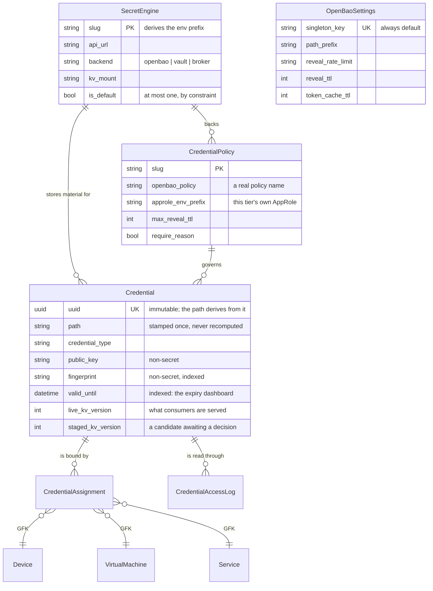

# Data model

Eight models: configuration and inventory plus two operational audit records.



## `OpenBaoSettings` — one configuration row

The fixed `singleton_key` is unique, making "at most one" a database fact. The
runtime reads the complete row once into a per-request memo, then falls back to
`PLUGINS_CONFIG` and the caller's hard default if no row exists. Reads use
`.first()` and never create the row; only the data migration and explicit API
saves do that. There is no shared Django cache, so stale fills cannot resurrect
old security controls and cache availability cannot break settings reads. The
cost is one indexed single-row query per request instead of zero. Uncommitted
settings reads are not memoised, and HTTP requests and background jobs bound
the lifetime of their thread-local snapshots. The settings UI is delivered
separately.

`path_prefix` is validated as a non-empty, structurally safe relative path and
can change, or the settings row be deleted, only while no credentials exist.
Credential creation and prefix updates use `select_for_update()` on the
settings row when it exists, so the guard cannot race a new credential. A
transaction-level advisory lock covers a fresh installation without a row.
Existing credential paths are stamped once, while the AppRole policy is scoped
to `secret/data/<path_prefix>/credentials/*`; allowing a later change would make
new writes fail as permission errors while existing credentials kept working.
If credentials predate the first settings row, its prefix must match their
stamped paths. Credential path derivation applies the same prefix validator to
the legacy `PLUGINS_CONFIG` fallback and fails closed when it is unsafe.

The row holds no OpenBao authentication material. `RoleID`, `SecretID`, and
tokens stay in the environment or referenced files under the same invariant as
`SecretEngine`.

## `SecretEngine` — one instance, one KV mount

Holds **no authentication material**. There is no `role_id`, `secret_id`, or
`token` column. Storing the vault's own credentials in the database this plugin
exists to keep secrets out of would defeat the whole design.

Instead the slug derives an environment prefix — `prod-core` →
`NETBOX_BAO_PROD_CORE` — and the RoleID and SecretID are read from the process
environment (or a file it points at) at the moment of login. See
[Configuration](../configuration.md#environment).

`status`, `last_checked`, and `status_message` are observed state, written by
[`EngineHealthJob`](background-jobs.md#enginehealthjob) and not user-editable.

`is_default` is enforced by a partial unique constraint, so "at most one
default" is a database fact rather than a convention. There is deliberately no
`default_engine` setting in `OpenBaoSettings`: a duplicate would be a second
place for the same decision to live, and therefore a place for the two to
disagree.

## `CredentialPolicy` — an authorization tier

Not a label. It maps onto a **real OpenBao policy** and can carry its own
AppRole, which is what makes it defence in depth:

1. NetBox object permissions, with constraints
2. The policy's `groups` gate
3. The OpenBao policy itself, reached through that tier's AppRole

Layer 3 bounds blast radius rather than re-authorizing the user: the backend
picks the AppRole from the credential's own policy, so a NetBox bug that hands
someone a `prod-core` credential reads it with the `prod-core` AppRole, which
OpenBao allows. What it buys is that a leaked SecretID reaches only its own
tier, and that a tier whose SecretID was never delivered to an instance is
unreadable from it. See [the security
model](../security.md#7-per-tier-approles).

Give each tier a genuinely separate AppRole and deliver its SecretID separately
— reusing one across tiers collapses layer 3 and leaves you with a label. See
[Set up a policy tier](../how-to/policy-tiers.md).

## `Credential` — the inventory record, never the material

Every field is non-secret by construction. The interesting ones:

| Field | Why it is here |
|---|---|
| `uuid` | Immutable identity. Editable is `False`; the path derives from this. |
| `path` | Stamped **once**, at creation. `path_prefix` becomes immutable once any credential exists, and recomputing existing paths would orphan material. |
| `public_key`, `fingerprint`, `key_type` | Extracted once at write time. Public by definition — a fingerprint is what you publish. |
| `cert_*`, `valid_from`, `valid_until` | Likewise: transmitted in the clear during every TLS handshake. `valid_until` is indexed, which is what makes the expiry dashboard one query. |
| `kv_version` | The **highest version ever written** at this path. This is what check-and-set compares against. |
| `live_kv_version` | The version consumers are served. Empty means "whatever is latest". |
| `staged_kv_version` | A written but unpromoted candidate. Empty when none. |
| `import_source` | Provenance, indexed — `netbox_secrets:142`. What makes a migration resumable and a repeated run a no-op. |

### Why the path is UUID-derived

```
<path_prefix>/credentials/<uuid>
```

A path derived from the object graph — `devices/core-sw-01/ssh` — breaks the
first time a credential is renamed, reassigned, or shared across a fleet. A
broken path is an orphaned secret nobody can find.

Discovery instead comes from KV v2 `custom_metadata`, which carries the
credential's ID, UUID, type, policy, assignments, and a `managed_by:
netbox-openbao` marker. Tooling outside NetBox can list the mount and filter on
those keys, and [`CredentialVerifyJob`](background-jobs.md#credentialverifyjob)
uses the marker to spot material under the plugin's prefix that NetBox no longer
has a row for.

!!! note "Why `credential_type` has no Django `choices`"

    Django validates a `choices` field in `clean_fields()`, which would reject
    every operator-defined [`CredentialTypeSchema`](credential-types.md) slug
    outright. Membership is checked in `clean()` against the union of built-in
    and stored types instead, and the model supplies
    `get_credential_type_display()` because tables and panels call it.

### Why the three version fields cannot be collapsed

`kv_version` and `live_kv_version` legitimately diverge after a discard, because
OpenBao's version counter **never goes backwards**. So `kv_version` stays high
while nothing is staged.

Never infer "is something staged?" from comparing them. `staged_kv_version` is
the answer, and `has_staged_version` is the property that reads it.

## `CredentialAssignment` — a through-table, on purpose

Modelled as many-to-many rather than as a GenericForeignKey on `Credential`
itself because the relationship genuinely is: one fleet SSH key is deployed to
hundreds of devices, and one device holds a login, an enable, and an
out-of-band credential.

Two constraints do real work:

- unique on `(credential, object_type, object_id, purpose)` — no duplicates
- unique on `(object_type, object_id, purpose)` **where `is_primary`** — so
  *"which credential does automation use here?"* always has exactly one answer

The permitted target types are enforced in the model's `clean()`, so the REST
API and any direct ORM caller are held to the same list as the form. They
resolve to `assignable_models` in `OpenBaoSettings` (or its `PLUGINS_CONFIG`
fallback), unioned with whatever
installed plugins registered through `netbox_openbao.registry`, minus
`assignable_models_deny` — see
[Assignable object types](../configuration.md#assignable-object-types).

The registry exists so an integrating plugin can declare its own
credential-holding models from `AppConfig.ready()` instead of requiring every
deployment to restate them in a settings file. The deny list exists so that
adding is not the same as deciding: registration comes from installed code, and
the operator keeps the final word.

## `CredentialAccessLog` — evidence, not an object

A **plain Django model**, deliberately not a `NetBoxModel`. It is append-only,
so change logging, journaling, and tags would be noise at best and a second
mutable copy of audit data at worst.

It records who, when, from where, which action, and whether it succeeded.
**Never the value.** It survives deletion of the credential through name and
UUID snapshots, and it is exposed read-only through the API — the same token
that reveals a secret cannot erase the record of having done so.

OpenBao's own audit device remains authoritative for what happened at the vault.
It only ever sees an AppRole, though, so it cannot say *which NetBox user*
asked. This table is the other half; `request_id` correlates the two.

!!! warning "It opts into `RestrictedQuerySet` explicitly"

    NetBox's object-permission machinery lives on `RestrictedQuerySet`, which a
    `NetBoxModel` inherits. A plain `models.Manager` has no `restrict()`, so
    this model sets `objects = RestrictedQuerySet.as_manager()` by hand — and
    its REST viewset must extend `NetBoxReadOnlyModelViewSet`, because
    `BaseViewSet.initial()` is the thing that calls `restrict()`. A viewset
    outside that hierarchy silently ignores every ObjectPermission
    *constraint*.

## `CredentialTypeSchema` — a credential type defined as data

Lets an operator model a vendor API key with three named fields, or a RADIUS
shared secret, without forking the plugin. Covered in [Credential
types](credential-types.md); the constraint that shapes it is that `extractor`
names a function from a **fixed registry** and is never an import path.
