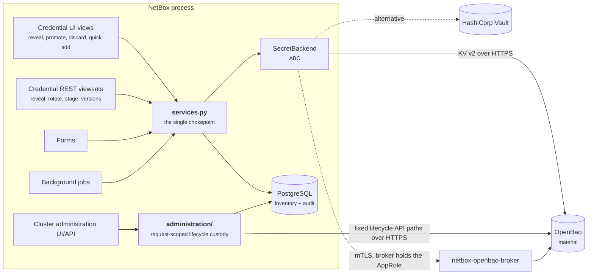

# Architecture

The plugin's shape follows from one decision — **secret material is not
NetBox's to hold** — and from four consequences of it that are worth
understanding before reading any code.

## The five moving parts

Read the arrows into `services.py` as the stored credential-material path: no
credential view, serializer, form, or job speaks to a credential backend
directly. Cluster initialization, unseal, and snapshot custody use the separate
bounded administration transport documented in the
[administration plane](administration-plane.md). Neither boundary persists or
logs request-scoped material.

## Four consequences

### 1. `Credential` has no column that could hold material

Not "must not" — *cannot*. There is no field to write to. The changelog, export
templates, the REST representation, a `SELECT *` by a DBA, a replica, a restored
backup: none of them can surface a private key, because none of them has one to
surface.

Everything else in [the security model](../security.md) is downstream of that
absence. It is enforced by a test that walks the model's fields and fails on any
secret-shaped name — see [Security invariants](invariants.md).

→ [**Data model**](data-model.md)

### 2. Two systems, one operation, no distributed transaction

OpenBao writes are not transactional with PostgreSQL, and **Django has no
rollback hook** — `transaction.on_commit` fires only on commit, so there is no
callback that runs when a transaction unwinds. Compensation is therefore
explicit and hand-written, and its *scope* matters more than its existence: a
compensator that destroys a whole path to clean up a failed rotation would take
the working secret with it.

→ [**The write path**](write-path.md)

### 3. Reading material is a separate permission, on a separate route

`reveal` is a NetBox model action of its own, so it appears as a checkbox in the
standard ObjectPermission form and accepts constraints like any other action.
A role can inventory every credential in the estate and read none of them.

The route it lives on is JSON-only, `no-store`, rate limited, and POST-only in
the UI — each for a specific reason rather than as a general precaution.

→ [**The reveal path**](reveal-path.md)

### 4. Replacing a credential is three steps, not one

A key deployed to hundreds of hosts cannot be rotated by overwriting it: there
is no verification step and no way back except reading an old version by number
and hoping it is still there. So rotation writes the candidate *alongside* the
live version, keeps serving the live one, and promotes only on a decision.

→ [**Staged rotation**](staged-rotation.md)

## Where each concern lives

| Module | Owns |
|---|---|
| `models/` | The inventory: engines, policy tiers, credentials, assignments, the audit log, stored credential types |
| `services.py` | Every stored credential-material operation — writes, reveals, rotation transitions, the audit write, and the tier's group gate |
| `administration/` | Bounded cluster lifecycle transport for request-scoped initialization, unseal, and snapshot custody plus metadata-only audit |
| `backends/` | The `SecretBackend` contract and its OpenBao, Vault, and broker implementations |
| `secrets/` | Credential type schemas, payload validation, and non-secret metadata extraction |
| `api/` | DRF serializers, viewsets, the reveal permission map, and the reveal throttle |
| `views.py`, `forms.py`, `ui/panels.py`, `tables.py` | The web UI, built on NetBox 4.7's declarative panel framework |
| `jobs.py` | Five NetBox system jobs: health, expiry, verification, rotation-due, log pruning |
| `importers/` | Migration from `netbox-secrets`, with type inference proved by extraction |
| `quickadd.py` | Device/VM → service + credential + assignment, in one transaction |

Every module is documented symbol-by-symbol in the
[code reference](../reference/).

## Reading order

If you are here to review the security posture, read in this order and stop
when you are satisfied:

1. [Security invariants](invariants.md) — the claims, and what enforces each
2. [The reveal path](reveal-path.md) — the only route material takes outward
3. [The write path](write-path.md) — the only route it takes inward
4. [Secret backends](backends.md) — the boundary, and what it refuses to leak

If you are here to extend it, start with [Credential
types](credential-types.md) and [Secret backends](backends.md); both are
designed as extension points and say what a new one must not do.
