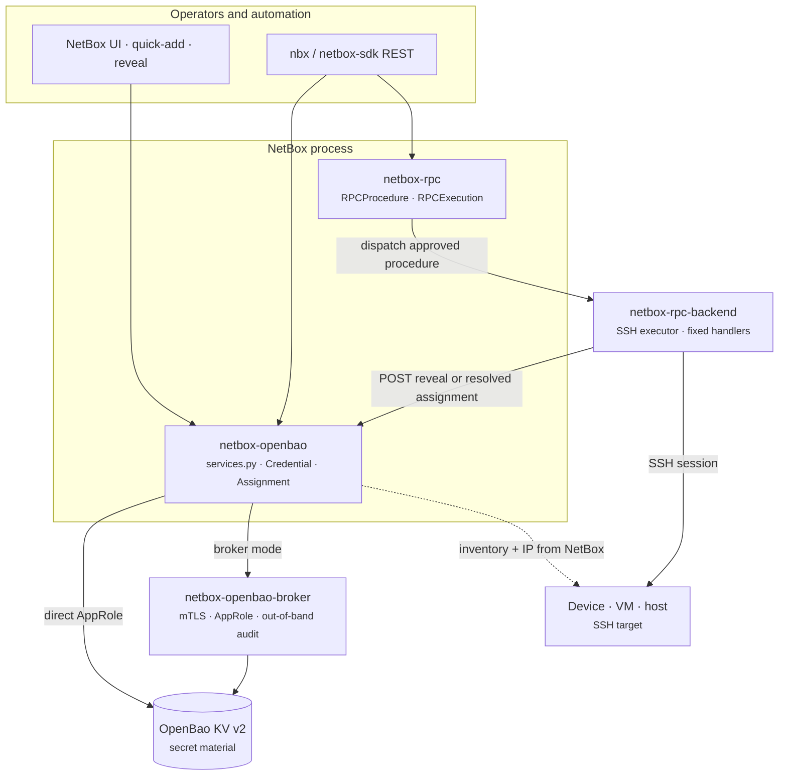

# netbox-openbao, broker, and netbox-rpc

The open-source stack for secret storage and audited host access in NetBox
centres on three projects that stay deliberately separate:

| Component | Role |
|---|---|
| **netbox-openbao** | NetBox plugin — credential inventory, RBAC, reveal API, OpenBao writes |
| **netbox-openbao-broker** | Optional sidecar — holds the AppRole; NetBox asks over mTLS |
| **netbox-rpc** | NetBox plugin — audited procedure catalog, approval gating, execution history |
| **netbox-rpc-backend** | SSH/CLI executor — runs fixed-argv handlers for dispatched procedures |

Material never lives in PostgreSQL. Procedures never accept arbitrary shell
text. Reveal and RPC dispatch are separate permissions on separate plugins.

## Stack diagram

Read the diagram as **two read paths to the same vault, one write path, one SSH
path**:

1. **Write** — always through `netbox-openbao` → OpenBao (direct or via broker).
2. **Human reveal** — operator or `nbx` POSTs to the openbao reveal endpoint;
   material never appears on GET.
3. **Automation SSH** — `netbox-rpc` queues a procedure; `netbox-rpc-backend`
   resolves credentials through the same openbao reveal contract, then runs a
   catalogued handler — not ad-hoc shell from the plugin.

## netbox-openbao-broker

In broker mode the NetBox host holds only an **mTLS client certificate**. The
broker holds the AppRole SecretID and talks to OpenBao. NetBox can *ask* for
material it is authorized to request; it cannot read the vault offline from
stolen database backups or config alone.

The broker's audit log sits outside NetBox's blast radius. Authorization is per
NetBox **instance** (path prefix), not a second copy of NetBox RBAC — NetBox
remains the authority on *who* may ask.

→ [Run broker mode](../how-to/broker-mode.md) ·
[netbox-openbao-broker README](https://github.com/emersonfelipesp/netbox-openbao-broker)

## netbox-rpc

`netbox-rpc` is the NetBox-side **catalog** of allowed host operations:
procedure definitions, parameter schemas, destructive/approval flags, and an
execution history auditors can query. It does not store secret material and does
not SSH itself.

Dispatch flows through `netbox-rpc-backend`, which maps each procedure to a
fixed handler. Guest VM login for a synced Proxmox inventory row still comes
from openbao assignments on that `VirtualMachine` — proxbox supplies *where* to
connect; openbao supplies *how* to authenticate.

OpenBao host maintenance (health, seal status, policy reload) also routes through
audited RPC procedures rather than shell from the plugin process.

→ [netbox-rpc on GitHub](https://github.com/N-MultiCloud/netbox-rpc)

## How this relates to Proxmox VM secrets

For Proxmox guests modelled by netbox-proxbox:

| Step | Component |
|---|---|
| Discover VM, interfaces, IPs | netbox-proxbox + proxbox-api |
| Store SSH password or keypair | netbox-openbao → OpenBao |
| Optional harden vault access | netbox-openbao-broker |
| Audited SSH or host procedure | netbox-rpc → netbox-rpc-backend |

See [Proxmox VM secrets](proxmox-vm-secrets.md) for the three-lane view focused
on inventory versus credential storage.

## Further reading

- [Architecture overview](index.md)
- [Secret backends](backends.md)
- [The reveal path](reveal-path.md)
- [Site: proxbox + openbao integration](https://emersonfelipesp.com/netbox-openbao/proxmox-secrets)
