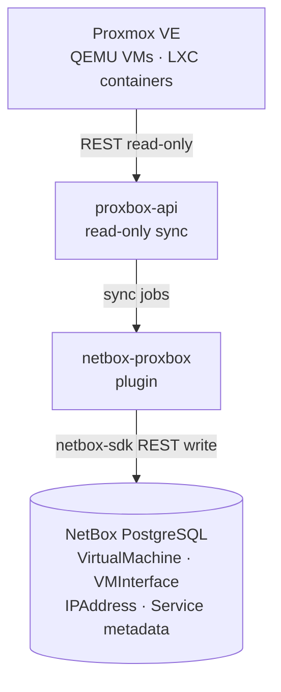
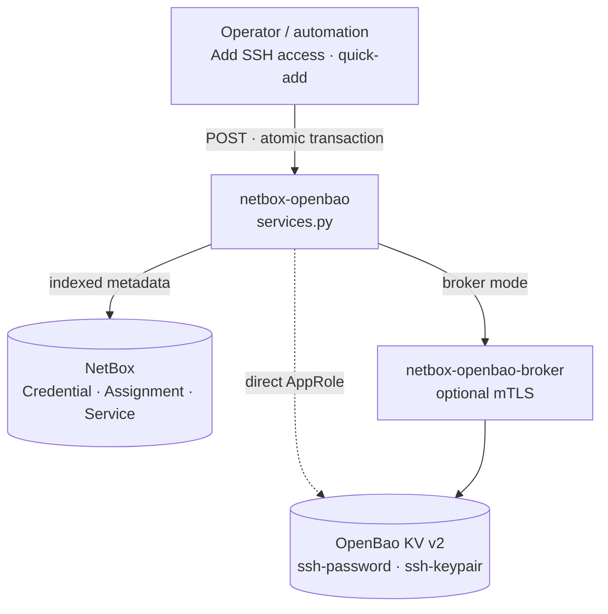
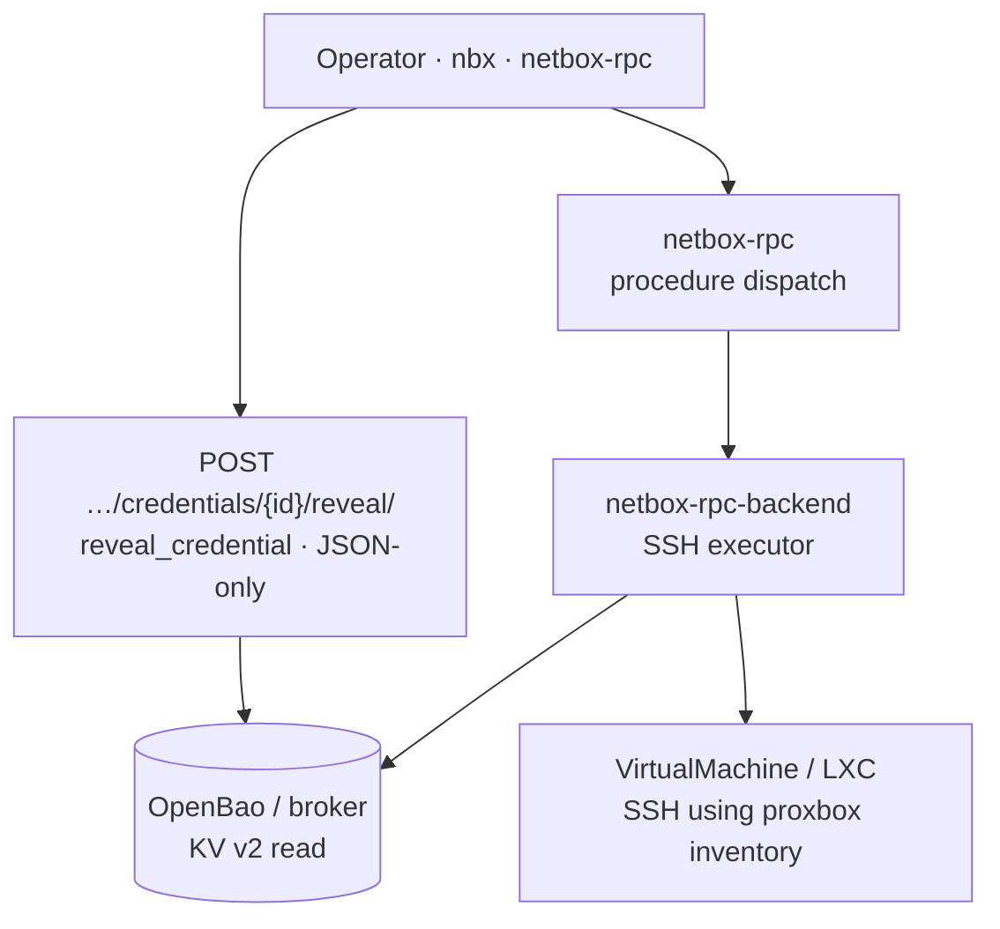

# Proxmox VMs, containers, and netbox-proxbox

netbox-openbao and netbox-proxbox solve different problems on the same NetBox
objects. Proxbox discovers Proxmox inventory — clusters, nodes, QEMU VMs, LXC
containers, interfaces, addresses, and optional `ssh` service metadata. OpenBao
stores login material — passwords and private keys — after those objects exist.

The plugins do not call each other. They meet on shared NetBox rows:
`virtualization.VirtualMachine`, `ipam.Service`, `Credential`, and
`CredentialAssignment`.

!!! tip "Interactive diagrams"
    A browser version of these diagrams lives on
    [emersonfelipesp.com/netbox-openbao/proxmox-secrets](https://emersonfelipesp.com/netbox-openbao/proxmox-secrets).

## Three lanes

### Lane 1 — Inventory sync (no secrets)

Proxbox sync is read-only against Proxmox. It never carries guest passwords,
cloud-init secrets, QEMU agent tokens, or SSH private keys. Even when proxbox
creates or updates an `ipam.Service` named `ssh` with `tcp/22`, that row
describes reachability — not the login secret.

See the netbox-proxbox companion doc:
[VM inventory without credentials](https://github.com/emersonfelipesp/netbox-proxbox/blob/develop/docs/companion-plugins/netbox-openbao.md).

### Lane 2 — Credential write (after the VM exists)

Quick-add SSH on a Device or VM page creates (when modeled):

1. An `ipam.Service` named `ssh` with `tcp/22` — or reuses the existing one.
2. A `Credential` whose material lives in OpenBao.
3. `CredentialAssignment` rows binding the credential to the service and to the
   object.

Material writes go through `services.py` to OpenBao directly or via
**netbox-openbao-broker** when broker mode is enabled — see
[openbao, broker, and RPC stack](openbao-broker-rpc.md).

→ [Quick-add SSH](../quick-add-ssh.md) · [The write path](write-path.md)

### Lane 3 — Reveal and SSH access

Reading material requires the `reveal_credential` action. Responses are
`Cache-Control: no-store`, POST-only in the UI, and fully audited. Automation
should use the plugin REST API or audited **netbox-rpc** procedures — not
Proxmox config scraping and not proxbox sync payloads.

→ [The reveal path](reveal-path.md) · [REST API](../api.md)

## What proxbox sync does not carry

| Source | In proxbox sync? | Where login material belongs |
|---|---|---|
| VM name, VMID, cluster, node | yes | NetBox inventory |
| Interfaces, MACs, IP addresses | yes | NetBox IPAM |
| `ssh` service (`tcp/22`) metadata | sometimes | NetBox `ipam.Service` |
| Cloud-init / guest passwords on PVE | **no** | Operator workflow or openbao |
| SSH login password or private key | **no** | netbox-openbao → OpenBao |

## Typical operator sequence

1. Run proxbox sync so the VM or container appears with interfaces and IPs.
2. Open the `VirtualMachine` in NetBox and use **Add SSH access** (quick-add).
3. Confirm username or public-key metadata on the credential row; material stays
   write-only on GET.
4. When access is needed, POST reveal with `reveal_credential` permission — or
   dispatch an audited **netbox-rpc** procedure that resolves material through
   the same openbao API.

## netbox-proxbox OpenBao integration

When `ProxboxPluginSettings.credential_storage_backend` is `openbao` (the
default), proxbox stores **endpoint** API tokens and SSH secrets through
netbox-openbao — not in Fernet `*_enc` columns. That is the same split-storage
model, applied to Proxmox *endpoint* credentials rather than guest VM logins.

Guest VM SSH credentials still follow the quick-add / assignment workflow on
the VM object after proxbox sync creates it.

## Further reading

- [openbao, broker, and RPC stack](openbao-broker-rpc.md)
- [Architecture overview](index.md)
- [Security model](../security.md)
- [netbox-proxbox companion: netbox-openbao](https://github.com/emersonfelipesp/netbox-proxbox/blob/develop/docs/companion-plugins/netbox-openbao.md)
- [Site diagrams: proxbox + openbao integration](https://emersonfelipesp.com/netbox-openbao/proxmox-secrets)
