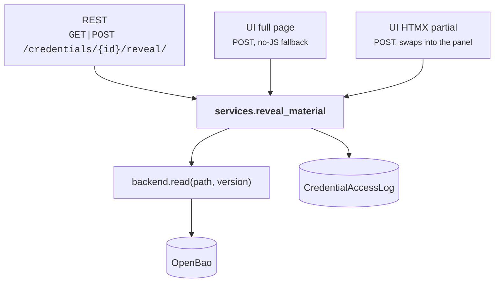

# The reveal path

This is the only route by which secret material leaves the plugin. Its defences
are concentrated here and stated explicitly, rather than inherited from
whatever the deployment happens to configure.

## Three surfaces, one implementation



The two UI surfaces share a base class, `_RevealBase`, rather than each
implementing the flow. That is deliberate: two code paths to the same secret
are two places for the permission check, the policy reason gate, and the
`no-store` headers to drift apart — and drift on this path is a disclosure bug,
not an inconsistency.

## What has to pass

| Gate | Where | Effect |
|---|---|---|
| `netbox_openbao.reveal_credential` | `restrict()` on the queryset | A role can inventory every credential and read none |
| ObjectPermission **constraints** | the same `restrict()` | `{"policy__slug": "lab"}` yields **404** on a production credential — not 403, which would confirm it exists |
| `CredentialPolicy.groups` | `services.enforce_policy_access` | A coarse tier gate, applied in addition to object permissions |
| `CredentialPolicy.require_reason` | `services.reveal_material` | A justification, recorded in the access log |
| The tier's OpenBao policy | the AppRole the request carries | Independent of NetBox entirely |
| Rate limit | `RevealRateThrottle` | Default `30/hour` per user |

!!! note "Why the group gate lives in the service layer"

    It used to live in the REST viewset's authorization helper — and only
    there. So a user belonging to none of a tier's permitted groups was refused
    over the API and served the same material by the credential page.

    It now sits beside `require_reason` in `services.py`, which is the
    chokepoint all five surfaces already go through: the two UI reveals, the UI
    promote/discard, the edit form's material write, and `PATCH`/`PUT` of
    `secret_data` — that last one is routed by DRF's own `update()` and never
    reached the helper at all, so the dedicated `rotate` action refused what
    the ordinary update route allowed.

    A refusal is recorded in the access log. A refused reveal is the entry you
    most want to see.

## Why the response cannot be stored

- **`renderer_classes = [JSONRenderer]`** on the action. DRF's
  `BrowsableAPIRenderer` would template the secret into an HTML page, and HTML
  is what caches, browser history, and *"save page as"* retain. Overriding it on
  the action removes it regardless of the deployment's
  `DEFAULT_RENDERER_CLASSES`.
- **`Cache-Control: no-store, no-cache, must-revalidate, max-age=0`**, plus
  `Pragma` and `Expires`. This stops the response being written to disk by a
  browser, a proxy, or a corporate TLS-inspecting middlebox.
- **The UI reveal is POST-only.** A GET-reachable reveal URL can be bookmarked,
  prefetched by the browser, followed by a link scanner, or replayed from
  history — all of which would fetch a secret without anyone deciding to. It
  also keeps the credential out of the URL bar and the referrer header.

The REST action accepts `POST` as well as `GET` for the same reason: so the
`reason` stays out of the URL, and therefore out of every intermediary's access
log.

!!! warning "`POST` maps to `add_<model>` unless you stop it"

    NetBox's `TokenPermissions.perms_map` maps `POST` to `add_<model>`. Left at
    the default, `add_credential` becomes the real gate on a POST `reveal` and
    the dedicated `reveal_credential` permission is decorative — anyone able to
    rotate would already be able to create, and a role holding only
    `rotate_credential` could not rotate at all.

    `api/permissions.SecretActionPermissions` remaps `POST` to `view_<model>`,
    and the action's own permission is enforced through `restrict()`. The
    inherited write-token check still applies, so a read-only API token cannot
    rotate.

## Version resolution

```
explicit ?version=N  →  live_kv_version  →  latest
```

The middle step is what keeps a [staged rotation](staged-rotation.md) from being
served before anyone has confirmed it works. An empty `live_kv_version` means
"whatever is latest", which is how every credential behaved before staged
rotation existed.

## TTL

```python
ttl = min(plugin_reveal_ttl, policy.max_reveal_ttl)
```

A policy tier can only lower the plugin-wide ceiling, never raise it.

The TTL is advisory — it is what the plugin tells a consumer about how long to
treat the value as valid. Nothing revokes anything when it elapses.

## The countdown is a convenience, not a control

Revealed material clears itself from the credential page after the TTL, and
there is a *Clear now* button. Both are worth having: a screen left unattended
stops displaying a secret.

Neither is a security boundary, and the UI says so rather than implying
otherwise. The material has already left the server by the time it renders;
anyone who wants to keep it can. Clearing the page revokes nothing, and the
access-log entry stands regardless.

The fragment ships inline script, which is only safe because values reach the
DOM through `textContent` and the node is dropped with `remove()`. Building
markup from a value would let material containing HTML execute in the operator's
session — `test_fragment_uses_no_innerhtml` enforces that by substring, so the
forbidden property name is kept out of the template's comments too.

## No GraphQL surface at all

The plugin registers no `graphql_schema`, so its models are not exposed through
NetBox's GraphQL API in any form — not even metadata.

This is deliberate rather than unfinished. GraphQL queries are logged verbatim
by most gateways, and a graph API's response shape is harder to audit than a
single named REST action. If metadata-only types are added later, a reveal field
must never be among them.

## What the caller sees on failure

The service layer raises **Django's** `ValidationError`, because it also serves
forms and management commands where DRF is not in play. DRF does not translate
it, so left alone it escapes as a **500** — which is what a user got for
something as ordinary as revealing a credential whose policy requires a reason
without supplying one.

`api/views._as_drf_validation_error` converts it. Every API action that calls
the service layer goes through it.
