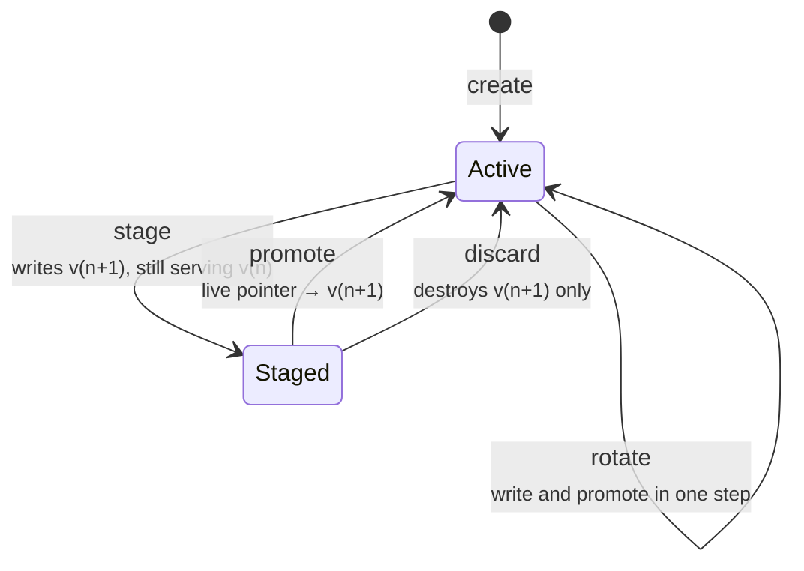

# Staged rotation

Rotating a credential by overwriting it works fine for a password one person
uses. It does not work for a key deployed to four hundred hosts, because the
moment you write the new value every consumer is on it, and there was no step
between "wrote it" and "found out it was wrong".

So a rotation here has three states and two decisions.

## The state machine



`rotate` still exists and is still the right thing for a credential with one
consumer you control. `stage` is for the other case.

## What each step does

### `stage`

Writes the replacement material as a **new version** and leaves
`live_kv_version` pointing at the old one. Sets `staged_kv_version` and moves
the credential's status to `staged`.

Every consumer keeps working, because [reveal resolves through
`live_kv_version`](reveal-path.md#version-resolution) before falling back to
latest.

!!! warning "The pre-existing-credential trap"

    A credential written before staged rotation existed has `live_kv_version =
    NULL`, which means *"serve latest"*. Staging under that rule would put the
    new, unverified version straight into service — the exact outcome staging
    exists to prevent.

    `stage_material` therefore pins the pointer to what is live **now** before
    writing the candidate:

    ```python
    if credential.live_kv_version is None and credential.kv_version is not None:
        credential.live_kv_version = credential.kv_version
        credential.save(update_fields=['live_kv_version'])
    ```

Only one candidate at a time. Staging over a staged version would leave two
unpromoted candidates and no coherent answer to *"which one does promote mean?"*

### `promote`

Nothing is written to the backend. The material is already there; promotion is
purely the NetBox-side decision about which version consumers are handed —
which is why it cannot fail halfway and needs no compensator.

It does one read first, and that read matters:

```python
versions = {v['version']: v for v in backend.list_versions(credential.path)}
staged = versions.get(credential.staged_kv_version)
if staged is None or staged.get('destroyed') or staged.get('deletion_time'):
    raise ValidationError(...)
```

Flipping the live pointer to a version that was destroyed out of band would
break **every consumer at once** — the precise failure this workflow exists to
avoid — and it would do it silently, because nothing reads the material during
promotion.

`verified=True` records that a human or a job confirmed the new material
actually works before it went live. Actually testing it against the device
belongs to whatever drives your devices; this is the place that remembers
someone did, so the access log can answer *"was this rotation checked?"* later.

### `discard`

Deletes **only** the staged version, leaving the live one untouched. Status
returns to `active`.

`kv_version` is deliberately left where it is. See below.

## Why three version fields, not two

`kv_version` and `live_kv_version` legitimately diverge after a discard, because
**OpenBao's current-version counter does not go backwards** when a version is
deleted. Check-and-set on the next write must still compare against the highest
number ever issued, so `kv_version` stays high while nothing is staged.

That divergence is exactly why *"is something staged?"* needs its own field
rather than being inferred from a comparison:

| Field | Means |
|---|---|
| `kv_version` | The highest version ever written here. What `cas` compares against. |
| `live_kv_version` | What consumers are served. `NULL` = "latest". |
| `staged_kv_version` | A candidate awaiting a decision. `NULL` = none. |

Never write `kv_version > live_kv_version` and read it as "staged". It is true
after every discard.

## Permissions

All three transitions are gated on `rotate_credential` rather than each getting
its own permission. They are three steps of one operation, and anyone trusted to
replace a credential's material is necessarily trusted to finish or abandon the
replacement.

Splitting them would produce permission combinations with no coherent meaning —
the right to promote material you were not allowed to stage, for one.

The [policy tier's group gate](reveal-path.md#what-has-to-pass) applies to all
three, on both the REST and the UI surfaces.

## Doing it

- Over the API: [Rotate without breaking
  consumers](../how-to/rotate-a-credential.md)
- In the UI: tick **Stage this change instead of applying it now** on the edit
  form. The *Staged rotation* panel then appears on the credential page with
  **Promote** and **Discard**, and it renders only while something is actually
  staged — an always-present panel offering to promote nothing would be noise
  on every credential page in the estate.
