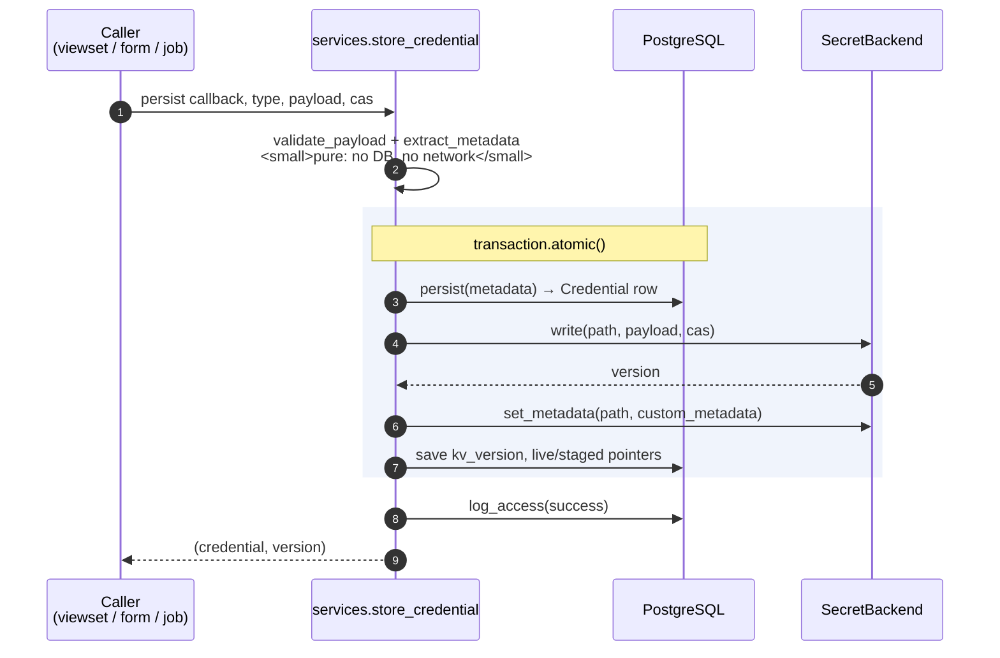

# The write path

Creating a credential means two systems must agree: a row in PostgreSQL and a
secret in OpenBao. They are not in a distributed transaction, and there is no
way to make them be one.

This page is about what happens when the second half fails.

## The single chokepoint

Every operation that touches material goes through `netbox_openbao.services`.
Views, serializers, forms, jobs, the importer, and quick-add all call it; none
of them constructs a backend for itself.

That is not a style preference. It is what makes two otherwise-unanswerable
questions answerable:

- *"Where could material leak?"* — one module, ~550 lines, all of it about this.
- *"Is this authorization rule applied everywhere?"* — yes, if it is
  implemented here. The `CredentialPolicy` group gate was once implemented in
  the REST viewset instead, and consequently was not applied by the web UI at
  all. See [`enforce_policy_access`](../reference/services.md).

## `store_credential`, step by step



Two details in that diagram are load-bearing.

**Validation happens before anything is persisted.** `prepare_material` is pure
— no database, no network — so a malformed key fails the request outright
rather than leaving material in OpenBao with no metadata in NetBox.

**Persistence is a callback, not a step.** The REST API needs
`serializer.save()`, which handles tags, custom fields, and m2m; forms and
internal callers just need `instance.save()`. Injecting it means one rollback
implementation serves both rather than each caller growing its own.

## Compensation, and why it is hand-written

Django provides `transaction.on_commit`. It does **not** provide the opposite:
there is no hook that runs when a transaction unwinds.

So the backend write happens inside the atomic block, the written path is
recorded in a local, and the enclosing `except` removes it before re-raising:

```python
except Exception as exc:
    # The database has already rolled back by the time we get here.
    if written is not None:
        backend, path, written_version = written
        destroy_everything = cas == 0
        ...
```

!!! danger "The scope of the rollback is the part that matters"

    `backend.delete(path)` with no `versions` argument destroys the path **and
    every version on it**.

    On a create — `cas=0`, meaning the write was only permitted if the path did
    not already exist — that is correct: nothing else was ever there.

    On a **rotation**, the path already held working material. Destroying it
    wholesale to clean up a failed rotation would take the live secret with it,
    turning a recoverable failure into data loss strictly worse than the orphan
    the compensator exists to prevent.

    `store_credential` branches on `cas` for exactly this reason. The rotation
    case removes only the version this write added.

If the compensating delete *itself* fails, it is logged at `ERROR` with the
literal string `ORPHANED SECRET`, naming the engine and the path.

Log it and mean it, because nothing else will find it. `CredentialVerifyJob` cannot find it. That job iterates **existing credential
rows** and asks whether each one's material is still there — so it detects the
opposite failure (a row whose secret is missing) and is blind to this one,
where the secret is present and the row is not. Reconciling in that direction
means listing the mount for `managed_by: netbox-openbao` material with no
matching row, which the plugin does not do yet. Alert
on the string.

On a failed **rotation** the row survives, so
[`CredentialVerifyJob`](background-jobs.md#credentialverifyjob) does still
check that path — but it checks that the path *resolves*, not that no extra
version is stranded on it, so an orphaned version is invisible to it too.

## Auditing a failure that never committed

Recording *"this write failed"* is harder than it looks, because after a
rollback the in-memory `Credential` still carries the primary key of an
`INSERT` that no longer exists. Foreign-keying an audit row to it raises a
deferred FK violation at commit — losing the audit record for the very failure
it was meant to capture.

`log_access` therefore takes `link=False`, and `_row_exists()` asks the database
which case this is:

- a failed **create** → the row is gone; record by name/UUID snapshot only
- a failed **update** → the original row still exists; link to it

The audit write is itself wrapped in a savepoint, so a failed audit insert
cannot poison the transaction the caller is still relying on — and any failure
is logged with `logger.exception` rather than swallowed silently.

!!! warning "The trap that made every HTTP access go unrecorded"

    NetBox's `get_client_ip()` returns a `netaddr.IPAddress`, not a string, and
    `GenericIPAddressField` cannot adapt it. Because the audit write is
    best-effort by design — it must never mask the operation's own outcome —
    the resulting error was swallowed, and **every HTTP-originated access went
    unrecorded** with nothing visible to the caller.

    `_request_context` calls `str()` on it. `test_reveal_is_audited` asserts the
    stored value is a `str`, so this cannot come back.

## Check-and-set on every write

| Operation | `cas` | Guarantees |
|---|---|---|
| create | `0` | The path must not exist. A create cannot silently overwrite material written outside NetBox at a colliding path. |
| rotate / stage | the recorded `kv_version` | Nothing has changed since we read it. A rotation cannot clobber a concurrent write it never saw. |

Both are verified against a **live** OpenBao and a live Vault in the
integration tests, because a fake proves nothing about whether `hvac` and the
server agree on what `cas` means. See [Development](../development.md).

## Deleting

A `post_delete` signal destroys the material when a `Credential` row is
removed, so deleting a credential in NetBox never leaves a readable secret
behind on the mount with nothing referencing it.

!!! danger "`post_delete`, deferred to `transaction.on_commit` — never `pre_delete`"

    Destroying a secret cannot be undone; a database transaction can be. Doing
    the irreversible half first gets the ordering exactly backwards: any later
    failure in the same transaction restores the row and leaves it pointing at
    material that no longer exists, which is unrecoverable and breaks every
    consumer of that credential.

    Bulk deletion made that routine rather than exotic —
    `perform_bulk_destroy()` puts N deletions in one transaction, so a single
    failure at the end destroyed the material of every credential before it
    while restoring all their rows.

    Deferring to commit trades it for the opposite residue: the row is gone and
    the material is not. That one is *recoverable* — the secret is still there
    to be found — so it is the right way round.

A backend failure is **logged rather than raised**: by the time the callback
runs the deletion has already committed, so raising could not undo it and would
only turn a logged residue into a 500 on a request that succeeded.

**Nothing reconciles that residue.**
[`CredentialVerifyJob`](background-jobs.md#credentialverifyjob) iterates
existing credential rows, so it finds a row whose secret is missing and is
structurally blind to a secret whose row is missing. Alert on the
`ORPHANED SECRET` log line — it names the engine and the path, and it is the
only signal. Reconciling in that direction means walking the mount for
`managed_by: netbox-openbao` material with no matching row, which the plugin
does not do yet.

## Custom metadata

Every write refreshes the KV v2 `custom_metadata` envelope — the credential's
NetBox ID, UUID, type, policy, assignment list, import provenance, and absolute
URL. An assignment change refreshes it too, through a `post_save`/`post_delete`
signal, on a best-effort basis: a stale assignment list would be worse than an
absent one, because it would be confidently wrong.

!!! bug "Empty values are illegal, and this broke every create"

    OpenBao rejects a zero-length `custom_metadata` value:

    ```
    custom_metadata validation failed: length of value for key "x" is 0
    but must be 0 < len(value) <= 512
    ```

    `netbox_assignments` is empty for a credential that has no assignments yet
    — that is, **every credential at the moment it is created**, since
    assignments can only be added afterwards. Sending it made every create fail
    against a real server while 200+ tests stayed green against the fake.

    `build_custom_metadata` drops empty values, and the fake now rejects them
    too. An absent key and an empty one mean the same thing to every consumer,
    and only one of them is legal.
