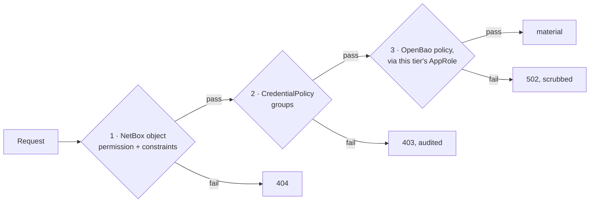

# Set up a policy tier

A `CredentialPolicy` with its own AppRole is the layer a NetBox-side permission
bug cannot get past. A `CredentialPolicy` without one is a label.

This walks through making the difference real.

## What a tier is

Three independent gates must all pass before material is returned:



Layers 1 and 2 are NetBox's. Layer 3 is not — which is what makes the first two
survivable.

## 1. Create the OpenBao policy and AppRole

One per tier. The AppRoles must be genuinely separate; that is the whole
mechanism.

```bash
bao policy write netbox-prod-core - <<'POLICY'
path "secret/data/netbox/credentials/*" {
  capabilities = ["create", "read", "update", "delete"]
}
path "secret/metadata/netbox/credentials/*" {
  capabilities = ["create", "read", "update", "delete", "list"]
}
POLICY

bao write auth/approle/role/netbox-prod-core \
    token_policies=netbox-prod-core token_ttl=1h token_max_ttl=4h
```

→ [Scope an OpenBao policy](scope-openbao-policies.md) for what these
capabilities each buy, and why `metadata/` is not optional.

## 2. Deliver its AppRole under its own prefix

The engine's slug gives the *default* prefix. A tier overrides it with
`approle_env_prefix`, and that override is what routes reads through a
different AppRole.

```ini
# /etc/netbox/openbao.env   (chmod 600)

# engine-wide default — used by tiers that set no override
NETBOX_BAO_PRIMARY_ROLE_ID=...
NETBOX_BAO_PRIMARY_SECRET_ID=...

# the prod-core tier
NETBOX_BAO_PROD_CORE_ROLE_ID=...
NETBOX_BAO_PROD_CORE_SECRET_ID=...
```

Prefer the `_FILE` form wherever your platform can mount a secret, so the value
never appears in `/proc/<pid>/environ`:

```ini
NETBOX_BAO_PROD_CORE_SECRET_ID_FILE=/run/secrets/bao-prod-core-secret-id
```

Apply to `netbox.service` **and** `netbox-rq.service`, then restart both.

!!! danger "Deliver the SecretIDs separately"

    Reusing one AppRole across tiers collapses layer 3 entirely. So does
    putting every tier's SecretID in one file that one compromise reads.

    If `prod-core`'s SecretID is only ever present on the host that needs it —
    or is only mounted into the workload that needs it — then a NetBox
    permission bug on a `prod-core` credential fails at OpenBao regardless of
    what NetBox decided.

## 3. Create the tier in NetBox

```bash
curl -X POST https://netbox.example.net/api/plugins/openbao/policies/ \
  -H "Authorization: Bearer $TOKEN" -H 'Content-Type: application/json' \
  -d '{
        "name": "Production core",
        "slug": "prod-core",
        "engine": 1,
        "openbao_policy": "netbox-prod-core",
        "approle_env_prefix": "NETBOX_BAO_PROD_CORE",
        "max_reveal_ttl": 120,
        "require_reason": true
      }'
```

| Field | Effect |
|---|---|
| `openbao_policy` | Documentation of which real policy this maps to. NetBox does not enforce it; OpenBao does. |
| `approle_env_prefix` | **The load-bearing one.** Blank falls back to the engine's prefix, which means this tier shares the engine-wide AppRole. |
| `max_reveal_ttl` | Caps the plugin-wide `reveal_ttl`. Lowers only, never raises. |
| `require_reason` | Every reveal must carry a justification, recorded in the access log. |
| `groups` | Layer 2: only members of these groups may reach credentials on this tier. Empty means the gate is unused. |

## 4. Add the NetBox-side gates

### Object permissions with constraints

Under **Administration → Permissions**, a role scoped to one tier:

- Object types: **NetBox OpenBao › credential**
- Actions: **View**, **Reveal**
- Constraints: `{"policy__slug": "lab"}`

A production credential then returns **404**, not 403 — a 403 would confirm it
exists.

### The group gate

Set `groups` on the tier. It is coarse — group membership, nothing more — and
applies **in addition to** object permissions, never instead of them.

It is enforced in the service layer, so it covers every surface: the REST
actions, both UI reveal paths, the UI promote and discard, the edit form's
material write, and `PATCH` of `secret_data`. Refusals are audited.

Superusers bypass it, as they bypass object permissions.

### What the group gate covers, exactly

It gates the operations that **read or replace** a credential's material:

| Operation | Gated |
|---|---|
| `reveal` — REST, full-page UI, HTMX UI | yes |
| `rotate`, `stage`, `promote`, `discard` — REST and UI | yes |
| `PATCH`/`PUT` of `secret_data`, including on the bulk list endpoint | yes |
| The edit form's material write | yes |
| `versions` (metadata only) | yes |
| **Any** update of an existing credential, material or not — including moving it to another tier | yes |
| **Creating** a credential on the tier | **no** — governed by `add_credential`. Provisioning into a tier you cannot yourself read from is a legitimate separation of duties, and gating it would break that. |
| **Deleting** a credential | **no** — governed by `delete_credential` and its object-permission constraints. |
| Management commands and background jobs | **no** — they run with no user, outside the web authorization model entirely. |

!!! danger "Why *every* update is gated, not just the material-bearing ones"

    `policy` is a writable field. Gating only updates that carry `secret_data`
    left this, in three requests:

    1. A user in `lab`'s groups but not `production`'s asks to reveal a
       production credential. Refused — `403`.
    2. They `PATCH` its `policy` to `lab`. No `secret_data`, so under a
       material-only gate this was an ordinary edit. `200`.
    3. They reveal it. `200`, and the material is returned.

    It works because credential paths are UUID-derived under one shared prefix,
    so the receiving tier's AppRole reads the very same secret — **layer 2 and
    layer 3 both fall to one request that never touches material.**

    The gate is therefore on the update itself, not on the `policy` field.
    Anything narrower is a denylist, and the next writable field that changes
    who may read a credential walks straight through it.

    A properly constrained deployment was never exposed to this: an
    ObjectPermission carrying `{"policy__slug": "lab"}` returns `404` on the
    `change` action for a production credential, so step 2 never succeeded.
    The gate is what protects a deployment that relies on group membership
    without also constraining every permission.

The two remaining "no" rows are deliberate rather than pending. Neither is a
disclosure path: a create writes material the creator still cannot reveal, and
a delete destroys material rather than exposing it.

## 5. Verify the separation is real

The test that matters is not "can the right person read it" — it is **"does the
wrong AppRole fail?"**

Temporarily unset the tier's SecretID and restart:

```bash
# with NETBOX_BAO_PROD_CORE_SECRET_ID absent
curl -H "Authorization: Bearer $TOKEN" \
  '.../credentials/<a-prod-core-credential>/reveal/?reason=test'
```

You should get a `502` naming a configuration problem, **not** material served
through the engine-wide AppRole. If it succeeds, `approle_env_prefix` is blank
or misspelled, and the tier is a label.

Put the SecretID back and confirm the reveal works again.

## A reasonable starting arrangement

| Tier | AppRole | `require_reason` | `max_reveal_ttl` | Groups |
|---|---|---|---|---|
| `lab` | engine-wide | no | 900 | — |
| `prod-access` | own | yes | 300 | `noc`, `neteng` |
| `prod-core` | own | yes | 120 | `neteng` |
| `imported` | own, read-only policy | yes | 300 | `neteng` |

`imported` is where a [`netbox-secrets`
migration](../migration-from-netbox-secrets.md) lands: a tier whose OpenBao
policy grants `read` and nothing else, so the copied material cannot be
modified through NetBox before anyone has verified it.
